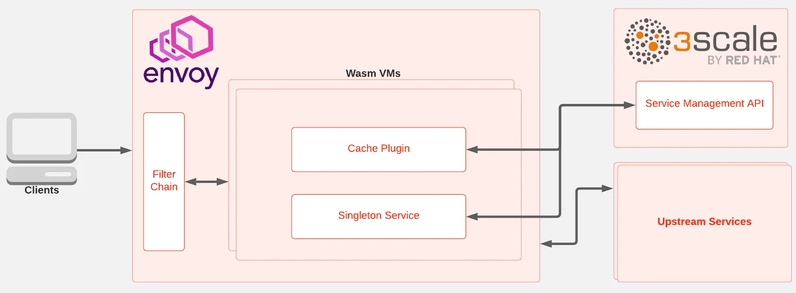
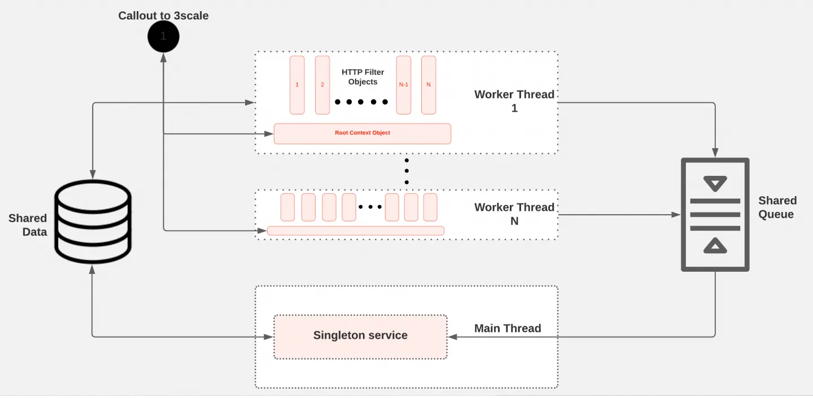
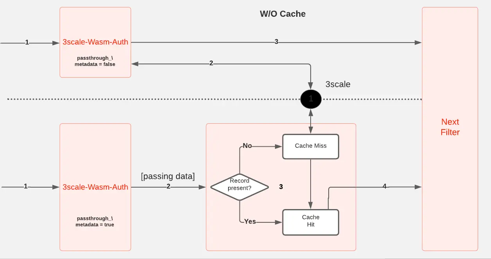

:::note
This article was originally published on [Red Hat Developer Blogs](https://developers.redhat.com/) and co-authored by Rahul Anand and Lahiru De Silva (myself).

Read the original article here: [Original Article on Red Hat Developer Blogs](https://developers.redhat.com/articles/2021/11/18/design-authorization-cache-envoy-proxy-using-webassembly)
:::

This article introduces a high-level design to implement an authorization cache associated with the Envoy proxy using WebAssembly. The goal of this project is to reduce the latencies of HTTP requests passing through the Envoy proxy by reducing the traffic to the service responsible for authentication and authorization of requests. The cache stores data about authorization so that the external service needs to be contacted only on cache misses, instead of for every HTTP request.

We also provide the source code of an authorization cache that interacts with [Red Hat 3scale API Management](https://developers.redhat.com/products/3scale/overview). The cache was implemented as a part of the [Google Summer of Code 2021 project](https://summerofcode.withgoogle.com/archive/2021/projects/6205479449001984).

This article is the first in a two-part series. This first article introduces a high-level, generic design that will give you a basic idea of the cache's overall functionality. The second part explains the major design decisions and implementation details.

## What is Envoy proxy?

[Envoy](https://www.envoyproxy.io/) is an [open source](https://developers.redhat.com/topics/open-source-communities) [edge](https://developers.redhat.com/topics/edge-computing) and service proxy for applications running in the cloud. Envoy is valuable for many use cases, including edge proxy, middle proxy, sidecar for service mesh deployments, and a daemon set within [Kubernetes](https://developers.redhat.com/topics/kubernetes). Among Envoy's compelling features, performance, extensibility, and [API configurability](https://developers.redhat.com/topics/api-management) are the most prominent, making it unique in the proxy space. This article mainly focuses on extensibility.

## The Envoy proxy authorization cache in action

The implementation uses [Proxy-Wasm](https://github.com/proxy-wasm/), implementing the extensions as WebAssembly modules. We made this choice based on the flexibility, portability, maintainability, and isolation (for fault tolerance) that WebAssembly offers when compared with native Envoy filters. At the time of writing this article, Proxy-Wasm supports two types of extensions: Filters and singleton services.

_Figure 1: Envoy communicates through the Wasm virtual machines with the 3scale Service Management API_

Figure 1 shows the interactions between the proxy, the 3scale Service Management API, and the upstream services when a client sends a request. The request is propagated through the Envoy filter chain. For access to Wasm filters and services, the request interacts with the Wasm Virtual machine (VM) to execute the Wasm plugins.

## Designing the authorization cache

In our design, the cache inside the proxy is implemented through two main components: A filter and a singleton service.

The filter is responsible for intercepting HTTP requests, authorizing them based on the stored cache, and performing rate limiting. In the context of the envoy, this component is an HTTP filter and gets executed in the worker threads. For each request, a context object gets created.

The singleton service is responsible for the background synchronization of cached data between the proxy and the 3scale Service Management API. In the context of the envoy, this is a singleton service and gets executed in the main thread outside the request lifecycle. Only one instance of this service gets instantiated in each Envoy process.

_Figure 2: The filter's threads and the singleton service share data and a message queue_

Figure 2 shows how the HTTP filter and singleton service interact with the other internal and external components to provide the expected functionality of the in-proxy cache. Shared data is an in-memory key-value store specified by the Proxy-Wasm ABI and provided by the proxy. Each VM contains a shared datastore. Because the two extensions (filter and singleton) are running in the same Wasm VM, both extensions have direct access to the shared data.

I/O between the host and VM is done in binary format and thus requires serialization and deserialization. The Proxy-Wasm ABI provides a shared queue that is also unique per VM. In our design, the shared queue is the main communication channel between the singleton service and filter. Any message enqueued is broadcast to all threads, but only one thread can dequeue the message. The singleton service updates the cache records saved in the shared data, either periodically or based on policies defined in the configuration. The HTTP filter uses the cache records in the shared data to perform authorization and rate-limiting.

### Filter design

The default Envoy proxy makes an external HTTP call to the 3scale Service Management API for every HTTP request to perform authorization and reporting. But with the internal cache, we eliminate this need and limit the external HTTP calls to cache misses (Figure 3). That way, we reduce the traffic on the 3scale Service Management API and therefore overall request latency, to a great extent.

_Figure 3: Envoy proxy filter chain with and without cache filter_

The filter serves as the entry point for the request authorization with the help of cached data. The filter takes one of two pathways for each request:

- **Cache miss**: This happens when a cache record is not found in the shared data. The filter calls out to the 3scale Service Management API to fetch the latest state.
- **Cache hit**: This happens when a cache record is present. Based on authorization results, metrics are passed to the singleton for reporting to the 3scale Service Management API.

The filter is equipped with an opt-in feature called unique-callout, which ensures that there is only one callout to the 3scale Service Management API on a cache miss. This feature increases performance and accuracy under high load, without any impact under low-load conditions. We'll look at the results with and without the unique callout feature in the second part of this series, when we get to examine the benchmarks.

### Singleton design

The singleton service serves two main functions for the proposed in-proxy cache design:

- Collect metrics based on a predefined policy and report them to the external management service.
- Update the local cache stored in the proxy by pulling the latest states of applications and services from the external management service.

In our case, the external management service is the 3scale Service Management API.

In Envoy, almost all the functions in worker threads and the main thread get executed in a non-blocking manner. So the methods get invoked as callbacks. In the singleton service, we use two types of events to perform the required functionality:

- Periodic events, triggered at predefined intervals via the `on_tick()` callback
- Events triggered by the filter through the message queue

Events that are sent from the filter pass through the message queue to the singleton service. The second part of this article offers further details about the integration of cache with the singleton section.

## Coming up: Implementing the cache

In the next part of this series, we'll dive into the implementation details of the cache, data modeling, various features that made the cache work better, limitations, and planned improvements.

---

**Next article in the series:**
[How we implemented an authorization cache for Envoy proxy](https://nomadxd.github.io/posts/2021-11-25-how-we-implemented-authorization-cache-envoy-proxy/)
