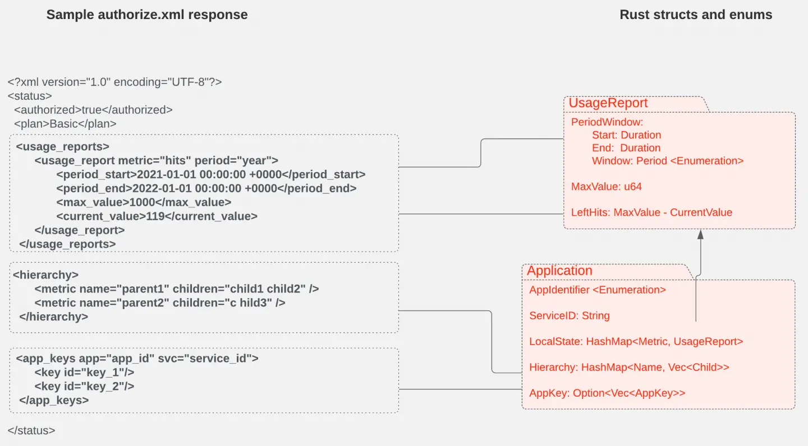
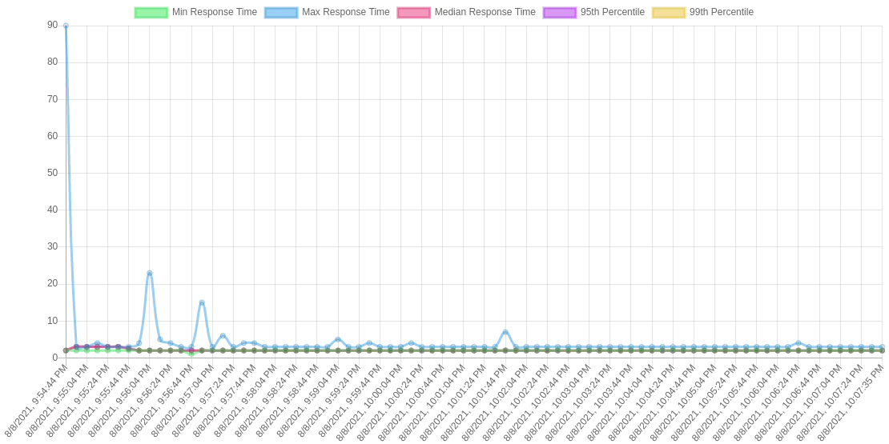
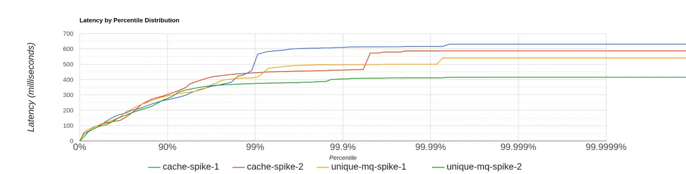

:::note
This article was originally published on [Red Hat Developer Blogs](https://developers.redhat.com/) and co-authored by Rahul Anand and Lahiru De Silva (myself).

Read the original article here: [Original Article on Red Hat Developer Blogs](https://developers.redhat.com/articles/2021/11/25/how-we-implemented-authorization-cache-envoy-proxy)
:::

This is the second article in a two-part series about an authorization cache we developed for the Envoy open source proxy as a part of [Google Summer of Code 2021](https://summerofcode.withgoogle.com/archive/2021/projects/6205479449001984). The [first article](https://nomadxd.github.io/posts/2021-11-25-how-we-implemented-authorization-cache-envoy-proxy/) in the series showed the design of our cache, based on [Proxy-Wasm](https://github.com/proxy-wasm/) and integrated with [Red Hat 3scale API Management](https://developers.redhat.com/products/3scale/overview). In this part, we focus on the implementation aspect of the design described in the previous article (check it out if you haven't already).

## Proxy-Wasm extensions

As mentioned in the first part of the series, at this time of writing Proxy-Wasm supports two main types of extensions: filters and singleton services. A filter executes in a worker thread and a singleton service executes in the main thread.

The Proxy-Wasm specification currently defines two types of filters: network filters and HTTP filters. There are also three types of contexts:

- `RootContext`: This context takes care of such tasks as reading the virtual machine (VM) configuration, reading plugin configurations, setting tick periods, creating contexts, and any work outside the request lifecycle. One `RootContext` gets created for each thread in each plugin.
- `StreamContext`: This context is used when writing network filters. One `StreamContext` gets created for each request.
- `HTTPContext`: This context is used when writing HTTP filters. One `HTTPContext` gets created for each request.

Our design uses a singleton service and an HTTP filter. So our implementation uses only a `RootContext` and an `HTTPContext`.

## Cache filter

A filter object has the same lifecycle as a request. Therefore, to reduce request latency, our implementation shifts any task that can tolerate a delay to the singleton service. The filter does only the bare minimum work required. As mentioned in the first part of the series, there are two main flows for the filter:

- **Cache miss:** Whenever a cache record is not present in the shared data, the filter proceeds with this path. Because the task is to authorize an HTTP request, the service ID and application ID are combined into a string into the format `{ServiceID}_{AppID}` to create the key in the cache. The filter calls out to the 3scale Service Management API to obtain the latest application state. Following the call-out response, the fetched state is stored as the cache entry value after deserialization, and future requests for the same service and application benefit from cache hits.

- **Cache hit:** If a cache entry is present, its serialized string value is fetched and deserialized into Rust structs. The decision to authorize the request is based on the left quota for each method and metric, which are already configured on the 3scale API Management dashboard. If authorized, the request is allowed to proceed to the next filter in the filter chain, and if not, a local response from the cache filter is sent back with appropriate response headers.

If any anomaly is found during the processing of the request, such as crucial missing information, a failure to serialize or deserialize the application state, or a processing failure by the host proxy, appropriate status codes are sent back.

Figure 1 shows how we map the XML entities in the authorization response to Rust variables and structs.

_Figure 1: Relationships between XML entities in the authorization response and Rust variables_

## Singleton service

The singleton service is responsible for two major functions: flushing the cache and updating the cache. These support the metrics we report on the use of different resources based on endpoints, URLs, etc.

Without the cache, all the request metrics are sent to 3scale API Management's Software-as-a-Service (SaaS) platform using the `authrep.xml` endpoint. The rapid updating of metrics allows users to see usage in almost real-time and hence with higher accuracy of reported metrics and higher latencies of the request being served. By design, if the cache is used, metrics are shown a bit later than the real-time request being served because of batching.

Our cache project eliminates the HTTP calls from the proxy to an external service on each request received. Instead, we rely on the stored cache records inside the proxy to minimize request processing time. To support the reporting of request usage and other related information to an external management service, we aggregate request usage over a particular time duration or based on a memory limit and then send bulk HTTP requests to the management service using the `report.xml` endpoint.

The local cache is flushed to an external service on a periodic basis or based on a predefined policy. Because we are using a singleton service, this cache flushing process runs in the main thread as a background task without blocking the worker threads.

The singleton service also updates the local cache with new snapshots of the applications and services. After flushing the local cache based on a configured policy, the local cache update process gets initiated. This process fetches the latest state of an application using the `authorize.xml` endpoint and updates the cache record stored inside the proxy with that latest data.

## Integration of cache with singleton

The first part of this series mentioned that the cache filter sends events to the singleton service via a message queue. Let's discuss that queue in more detail.

Our implementation uses the shared queue feature in the Proxy-Wasm ABI. The shared queue is one of the most under-represented features of Proxy-Wasm. Still, it can be used for more complex applications such as sharing data between worker threads, cross-VM communication, etc. In our case, we use it to transfer request metadata from the cache filter to the singleton service.

A shared queue supports basic enqueue and dequeue operations, as well as a callback that notifies the recipient whenever data is available in the queue. We effectively used this callback mechanism to implement an event-passing system between the filter and the singleton, so the singleton service doesn't have to check the shared queue for messages.

## Testing

For a project with several interconnected components, integration tests and end-to-end tests are essential to verify the functionality of the features and ensure that new development does not break previously implemented functionality. So we invested time and effort to develop a complete end-to-end testing framework that runs all the tests in a Docker Compose setup with all the required services running in Docker containers.

The integration testing framework has the following key features:

- Using everything as we use in a real production environment without mocking
- Flexibility to start new proxy instances per each test or per each test suite
- Generating an Envoy configuration from a common template

## Additional cache features

Some of the other neat capabilities of our cache include:

- **Custom metrics:** One of the primary goals of the Envoy proxy is to make the network understandable. Envoy can emit a large number of statistics, depending on how it is configured. We made use of Envoy's metrics API to define custom metrics that are more related to business logic. For example, we defined custom metrics to record the total number of applications stored in the cache, total Authorize calls to the 3scale Service Management API, total timeouts for the Authorize calls, etc. The metrics defined here can be scraped by Prometheus and visualized with a Grafana dashboard.
- **Unique call-out:** The unique call-out feature ensures that, for a single record, there is only one call-out to the 3scale Service Management API. Because there is no synchronization mechanism between worker threads, we created an [issue](https://github.com/envoyproxy/envoy/issues/17576) in the upstream envoy proxy project to request a solution for this use case. But because any change in the ABI will take more time than we had at Google Summer of Code, we found a way to use shared data as a placeholder for the lock and message queues to signify the resumption of waiting contexts between different threads. This use required us to bend the expected use of `set_shared_data` by sending some non-zero CAS value to avoid the initialization of the entry by multiple threads. There is still a nearly infinitesimal chance of multiple initializations, but their eventual correction is assured.
- **Visible logs:** Writing unit tests for Proxy-Wasm modules was not reasonable because it requires a runtime that is available during only integration, and at that stage, we cannot check individual functions. So we decided to blur the line between unit and integration tests by developing a feature called visible logs. If enabled, trace logs are sent in the response header, which is later matched against regular expressions to see whether the expected strings appear and thus verify the function's inner workings as unit tests do. This feature was implemented by intercepting and storing the logs for each request and dumping them into a response header when the response is ready.

## Benchmarks

Performing reliable and accurate benchmarks is crucial for our project because the main goal of the project is to improve the performance of request latency. So we performed extensive benchmarks for different traffic profiles and configurations. Results clearly show that the proxy with our internal cache outperformed the proxy without the cache. Figure 2 shows results from the proxy without the internal cache, while Figure 3 shows the proxy with our cache.

_Figure 2: Response times are noticeably high without the cache_

_Figure 3: Response times stay low with the cache in place_

Also, we can see the transition from cache miss to cache hit in the request latency diagram of the proxy, where it is marked by a sudden drop in the maximum latency curve.

Apart from benchmarking request latencies, we also benchmarked the unique call-out feature to prove that it improves performance during the initial cache miss stage by preventing multiple HTTP calls. Figure 4 compares request latencies for the setup with and without unique call-outs.

_Figure 4: Latencies are improved by the unique call-outs feature_

The blue and red lines represent two loads without enabling unique callout, and the rest of them are with unique callout enabled. It shows 99% of the request latencies are similar for both of the setups, but the setup with unique call-outs outperforms the default proxy setup during the initial cache miss period. (The final 1% of the diagram denotes the high latency requests during the initial cache miss period.)

All our benchmark results can be found in the [3scale-labs repository](https://github.com/3scale-labs/gsoc-wasm-filters/tree/main/benchmark).

## Limitations and planned improvements

For the most part, our modules do what they are supposed to do But some limitations exist and we can see areas for improvement. Here is a non-exhaustive list:

- Under the hood, the cache is just a C++ hashmap. Any problems hashmaps produce at scale are present in our cache as well. One way to improve this scaling problem is to run a dedicated database process such as Redis run alongside the envoy process. However, the dedicated process would also marginally reduce the savings in latency.
- Proxy-Wasm's host implementation uses mutexes per access type (read/write) for concurrency control on the cache, which means that at most one write and one read can have concurrent access to the cache. To improve parallelism, we can define an atomic operation on each entry (slightly increasing memory use). If we made this change, multiple threads would be able to access different entries concurrently, whereas now only one thread at a time has access to one entry.
- With the current implementation, the singleton service can be configured to operate in three modes: container, periodic, and default. These modes define how the cache's flush and update operations are performed. However, these simple configurations don't allow the developer to define the behavior of individual stages in the cache flush/update process. The singleton service can be made more intelligent and fault-tolerant by implementing a policy-based system for cache flushes and updates.
- To overcome the issues and constraints imposed by Wasm, Proxy-Wasm, and Envoy, we could implement an external service extension based on a local remote procedure call (RPC) mechanism.
- As of right now, there is no ability to delete an entry fully in the cache due to limitations in the ABI. But this will be fixed soon in the next ABI update by the maintainers.

## Conclusion

We worked hard during the Google Summer of Code to get this project where it is today. The cache will hopefully be in production during the next release cycle of [Red Hat OpenShift Service Mesh](https://www.redhat.com/en/technologies/cloud-computing/openshift/what-is-openshift-service-mesh). But without the help of the great 3scale API Management team, especially our mentor Alejandro Martinez Ruiz, it wouldn't have been possible for us to complete this project and then write an article about it. We would also like to thank Andrew Mackenzie for his support and rigorous reviews of this series.

Finally, we highly encourage students to consider applying to Google Summer of Code, because it changed our lives and careers for the better and can help others too.
