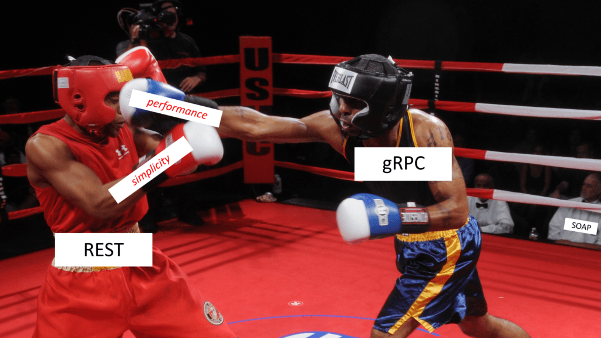

Since both protocol buffers and gRPC framework are developed internally at Google and then open sourced, let's first see what google says about them.

## Protocol buffers

> Protocol buffers are Google's language-neutral, platform-neutral, **extensible mechanism for serializing structured data** – think XML, but smaller, faster, and simpler.You define how you want your data to be structured once, then you can use special generated source code to easily write and read your structured data to and from a variety of data streams and using a variety of languages.

So the highlighted text defines exactly what protobufs do. But what is data serialization? Data serialization is the process of converting some in-memory object to another format that could be used to either store in a file or sent over the network. In layman terms, protocol buffers convert application level data objects to binary data that can be stored or transmitted over the wire. So this is where gRPC comes to play. gRPC deals with the process of transmitting the binary data generated from protocol buffers. Let's see what google says about gRPC.

## gRPC

> gRPC is a modern open source **high performance RPC framework** that can run in any environment. It can efficiently connect services in and across data centers with pluggable support for load balancing, tracing, health checking and authentication.

So from the above definition, it is clear that gRPC is a RPC framework which has several improvements over traditional RPC frameworks. If you don't know what a RPC framework is, simply it's a set of tools that enable the programmer to call a piece of code in a remote process, be it on a different machine or just another process on the same machine.

## Developer workflow

1. Create a `.proto` file and define the message types and services that we want to work with.A message is analogous to a request/response in the REST world. We have to define messages by using the in-built [data types](https://developers.google.com/protocol-buffers/docs/proto3#simple). And then we have to define services. In gRPC there are 4 types of services that we can use.
   - gRPC unary
   - gRPC client streaming
   - gRPC server streaming
   - gRPC bi-directional streaming

   Since this is an introductory article, I am not going to explain about
   them further.

2. Then we have to use the `protoc` compiler and compile the `.proto` file that we created in the previous step. For this step, you have to install the protoc compiler. Follow the official installation guide for protoc compiler installation.

3. After compiling the proto file in the previous step, proto generated files will be there in a location that you specified. For example in `C++`, two files will be generated with file extensions `.pb.h` and `.pb.cc`. In `golang` it will be a single file with `.pb.go`. Other programming languages that support protocol buffers will generate one or more files with different file extensions based on the language. These files contain methods that can be used to create messages, send and receive messages etc.

4. As the final step, the generated files can be imported from the application source files and the relevant methods can be used to build, send and receive messages.

Since this is an introductory article, I'm not going to add an example here. I hope to publish separate articles for the different types of gRPC services with examples.

## gRPC vs REST

Now, let’s do a quick comparison of gRPC and REST to see their differences.

1. gRPC uses HTTP/2 which is, as you know, much faster than HTTP/1.1 used in REST by default. Note that today we can enable HTTP/2 in REST as well, but normally it often goes with HTTP/1.1. Binary framing, compression and multiplexing capabilities of HTTP/2 improves the performance of gRPC significantly when compared to REST with HTTP/1.x.
2. gRPC uses Protocol buffer to serialize payload data, which is binary and smaller, while REST uses JSON, which is text and larger.
   - One of the common questions that arises when you learn about binary
     serialization of protocol buffers is that **"does it matter when
     everything that is transferred through the wire is binary?"**
     In trying to answear that question, let's see how text based
     serializers work. A text based serializer, serialize everything as
     text to make it more human readable. This process will add several
     symbols to make it more clean and human readable which adds more
     bytes.Since at the bytes level, a string values usually takes more
     space than other data types,compared to binary serializers, text
     based serializers generates more bytes. So a text based serializer
     will first serialize application data objects into a text and then
     the bytes relevant to that text is transferred through the wire. In
     contrast to text based serializers, binary serializers serialize
     application data objects to binary data which lives more closer to
     the hardware. For example let's consider the integer 42.

-     json - {"id":42} - 9 bytes if we assume ASCII or UTF-8 encoding and no whitespace.
-     xml - <id>42</id> - 11 bytes if we assume ASCII or UTF-8 encoding and no whitespace - and no namespace noise like namespaces.
-     protobuf - 0x08 0x2a - 2 bytes

  Due to small payloads, fast and efficient serialization in protocol
  buffers, gRPC performs better than REST with HTTP/1.x in most of the
  scenarios. But at the same time binary serialization makes it more
  difficult to work with/debug a gRPC API than a REST based API.

3. The API contract in gRPC is strict, and required to be clearly defined in the proto file. While in REST, it’s often loose and optional. We can define it via OpenAPI if we want, but it’s not mandatory. Having a strict contract makes it easy for the developers to develop and maintain the API when several teams are involved in the process. However for simple APIs, gRPC can consume extra unnecessary time and effort. Also protobuf field numbers can be used to evolve the API with versions while making the API backward compatible.
4. Code generation is built-in in gRPC with the help of protocol buffer compiler. While in REST, we must use third-party tools like OpenAPI and Swagger. gRPC support is not available in all of the programming languages. gRPC is currently [officially](https://grpc.io/docs/languages/) supported in most of the widely used programming languages and there are several other community based implementations.
5. gRPC APIs are not strictly resource/entity oriented although they can be defined in a resource/entity oriented way. In contrast REST APIs are mostly entity/resource oriented and must be resource/entity oriented if it is defined as a RESTful API. Resource/entity orientedness of REST APIs can be a performance bottleneck when several resources are needed to perform a certain operation since a HTTP call is required per operation per resource. _(Only if the API is resource/entity oriented)_. For example if resource B is needed to be updated after creation of resource A, then a POST request is required for resource A and a PUT request is required for resource B. We can implement both of those under one gRPC service since gRPC is not strictly resource/entity oriented.
6. With the HTTP/2 streams, gRPC has better support for streaming than the HTTP/1.x. With HTTP/1.x server streaming can be achieved using server sent events (SSE) or by maintaining a persistent connection by specifying `Transfer Encoding: chunked` in the response header. Compared to that, gRPC offers better support for streaming by providing client streaming, server streaming and bi-directional streaming out of the box.

## When to use gRPC

From the previous section it is pretty obvious that gRPC has a lot of new features and strengths when compared to HTTP/1.1x based REST APIs. However with the current state of gRPC, browser support is not yet available. It's impossible to directly call a gRPC service from a browser today. gRPC heavily uses HTTP/2 features and no browser provides the level of control required over web requests to support a gRPC client. For example, browsers do not allow a caller to require that HTTP/2 be used, or provide access to underlying HTTP/2 frames. To overcome this issue, [grpc-web](https://grpc.io/blog/state-of-grpc-web/) was introduced but not all grpc features are supported in grpc-web. The basic idea of grpc-web is to have the browser send normal HTTP requests (with Fetch or XHR) and have a small proxy in front of the gRPC server to translate the requests and responses to something the browser can use. Due to this limitation , grpc is mostly used for internal service to service communication.

gRPC is well suited to the following scenarios.

- **Microservices**: gRPC is designed for low latency and high throughput communication. gRPC is great for lightweight microservices where efficiency is critical.
- **Point-to-point real-time communication**: gRPC has excellent support for bi-directional streaming. gRPC services can push messages in real-time without polling.
- **Polyglot environments**: gRPC tooling supports all popular development languages, making gRPC a good choice for multi-language environments.
- **Network constrained environments**: gRPC messages are serialized with Protobuf, a lightweight message format. A gRPC message is always smaller than an equivalent JSON message.
- **Inter-process communication (IPC)**: IPC transports such as Unix domain sockets and named pipes can be used with gRPC to communicate between apps on the same machine. For more information, see Inter-process communication with gRPC.

## References

- [gRPC vs REST: Understanding gRPC, OpenAPI and REST and when to use them in API design](https://cloud.google.com/blog/products/api-management/understanding-grpc-openapi-and-rest-and-when-to-use-them)
- [REST vs RPC: What problems are you trying to solve with your APIs?](https://cloud.google.com/blog/products/application-development/rest-vs-rpc-what-problems-are-you-trying-to-solve-with-your-apis)
- [What is HTTP Streaming?](https://www.pubnub.com/learn/glossary/what-is-http-streaming/)
- [The state of gRPC in the browser](https://grpc.io/blog/state-of-grpc-web/)
- [Compare gRPC services with HTTP APIs](https://docs.microsoft.com/en-us/aspnet/core/grpc/comparison?view=aspnetcore-5.0)
