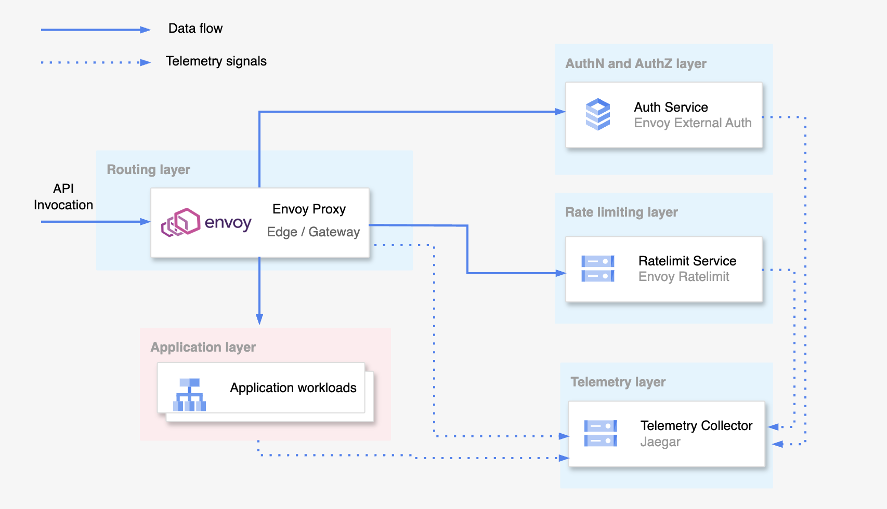

APIs (Application Programming Interfaces) have become an integral part of modern software development. They allow different applications to communicate and exchange data, enabling developers to create complex systems that integrate multiple services and technologies. APIs are used by companies of all sizes to power their digital products and services, from social media platforms to financial systems.

However, APIs can also be complex and challenging to manage, particularly when it comes to security and scalability. As APIs are exposed to the internet, they are vulnerable to attacks such as injection, denial of service, and man-in-the-middle attacks. Furthermore, as API usage grows, it becomes increasingly challenging to scale them to meet the demands of growing user bases and increasing traffic. This article aims to demonstrate the use of open source technologies, such as Envoy Proxy, to build a secure, scalable, and resilient Application Programming Interface (API) layer for organizations that depend heavily on APIs.

The following design will be implemented within the scope of this article to demonstrate the creation of a secure and scalable API layer.



First, let's start with the external authentication service and the related proxy configuration, as it is the first service that Envoy Proxy calls when a request is received.

## External Authorization with external authorization gRPC service

Envoy Proxy supports external authorization through its built-in external authorization filter. The external authorization filter should be added to the filter chain with a reference to the relevant external gRPC/HTTP service. When a request is received, it is propagated through the filter chain, and upon reaching the external authorization filter, Envoy Proxy sends an authorization check request to the configured external authorization service. The authorization service receives the request, which includes information about the original request from the client/downstream, such as headers and body. After performing authorization, the external authorization service must return the response in the expected format for Envoy Proxy. Based on the response, Envoy Proxy will either pass the request to the next filter or return an unauthorized response to the client/downstream.

This approach allows for a flexible and modular authorization architecture, where the authorization logic can be separated from the core application logic, making it easier to manage and scale. Additionally, it enables integration with a wide range of authorization providers, such as OAuth, LDAP, and more.

Let's go through the relevant envoy proxy configuration and the sample external authorization gRPC service.

### External authorization filter configuration

Add external authorization filter to the filter chain with a reference to the cluster that represents the external authorization service.

```yaml
http_filters:
  - name: envoy.filters.http.ext_authz
    typed_config:
      "@type": type.googleapis.com/envoy.extensions.filters.http.ext_authz.v3.ExtAuthz
      grpc_service:
        envoy_grpc:
          cluster_name: ext_authz
        timeout: 2s
      transport_api_version: V3
```

### External authorization service configuration

Add the external authorization cluster to the cluster configuration.

```yaml
clusters:
  - name: ext_authz
    type: STRICT_DNS
    lb_policy: ROUND_ROBIN
    typed_extension_protocol_options:
      envoy.extensions.upstreams.http.v3.HttpProtocolOptions:
        "@type": type.googleapis.com/envoy.extensions.upstreams.http.v3.HttpProtocolOptions
        explicit_http_config:
          http2_protocol_options: {}
    load_assignment:
      cluster_name: ext_authz
      endpoints:
        - lb_endpoints:
            - endpoint:
                address:
                  socket_address:
                    address: ext_authz
                    port_value: 50051
```

#### Sample gRPC authorization service written in go

```go
package main

import (
	"context"
	"fmt"
	"log"
	"net"
	"net/http"
	"strings"
	"time"

	auth "github.com/envoyproxy/go-control-plane/envoy/service/auth/v3"
	"github.com/golang-jwt/jwt"
	"google.golang.org/genproto/googleapis/rpc/code"
	"google.golang.org/genproto/googleapis/rpc/status"
	"google.golang.org/grpc"
)

type AuthServer struct{}

var secretKey []byte = []byte("my_secret_key")

func (authServer *AuthServer) Check(ctx context.Context, request *auth.CheckRequest) (*auth.CheckResponse, error) {
	log.Printf("Auth server received auth request: %v", request.String())
  // Extract the authorization token from the request
	authHeader, ok := request.Attributes.Request.Http.Headers["authorization"]
	var tokenString string

	if ok {
		tokenString = strings.TrimPrefix(authHeader, "Bearer ")
	}
	fmt.Printf("Token: %s", tokenString)
	_, err := jwt.Parse(tokenString, func(token *jwt.Token) (interface{}, error) {
		if _, ok := token.Method.(*jwt.SigningMethodHMAC); !ok {
			return nil, fmt.Errorf("unexpected signing method: %v", token.Header["alg"])
		}
		return secretKey, nil
	})
	fmt.Printf("Error: %v", err)
  // If valid token, returns Code_OK
	if err == nil {
		return &auth.CheckResponse{
			Status: &status.Status{
				Code: int32(code.Code_OK),
				Message: "AuthServer authentication successful",
			},
		}, nil
	}
  // If invalid token, returns Code_PERMISSION_DENIED
	return &auth.CheckResponse{
		Status: &status.Status{
			Code: int32(code.Code_PERMISSION_DENIED),
			Message: "AuthServer authentication unsuccessful",
		},
	}, nil
}

func main() {
	lis, err := net.Listen("tcp", ":50051")
	if err != nil {
		log.Fatalf("failed to listen: %v", err)
	}
	opts := []grpc.ServerOption{grpc.MaxConcurrentStreams(10)}
	s := grpc.NewServer(opts...)

	auth.RegisterAuthorizationServer(s, &AuthServer{})

	log.Println("Starting gRPC Server at 50051")
	s.Serve(lis)
}
```

## Rate limiting with envoy ratelimit gRPC service

Envoy Proxy offers multiple rate limiting strategies, including local rate limiting, circuit breaking, and global rate limiting. For this article, we will focus on global rate limiting using the Envoy External Rate Limit Service. Local rate limiting and circuit breakers can also be used in cases where network connection level rate limiting is needed, in addition to application level rate limiting enforced by the global rate limit service.

### Add ratelimit filter to the HTTP filter chain

Similar to external authorization, we need to add the Envoy Rate Limit filter to the filter chain to enable the Envoy Proxy to call the global rate limit service. It's important to add the Rate Limit filter after the External Authorization filter to reduce the load on the external ratelimit service.

```yaml
http_filters:
  - name: envoy.filters.http.ext_authz
    typed_config:
      "@type": type.googleapis.com/envoy.extensions.filters.http.ext_authz.v3.ExtAuthz
      grpc_service:
        envoy_grpc:
          cluster_name: ext_authz
        timeout: 2s
      transport_api_version: V3
  - name: envoy.filters.http.ratelimit
    typed_config:
      "@type": type.googleapis.com/envoy.extensions.filters.http.ratelimit.v3.RateLimit
      domain: default
      failure_mode_deny: true
      enable_x_ratelimit_headers: DRAFT_VERSION_03
      rate_limit_service:
        grpc_service:
          envoy_grpc:
            cluster_name: ratelimit
        transport_api_version: V3
```

### Provide ratelimit configuration to the external ratelimit service

Envoy Rate Limit Service uses descriptors which are basically key, value pairs to perform rate limiting. In order to use the Envoy Rate Limit Service, we need to provide rate limits related to the descriptors as configuration to the Rate Limit Service.

```yaml
---
domain: default
descriptors:
  - key: version
    value: v1
    rate_limit:
      unit: second
      requests_per_unit: 5
  - key: version
    value: v2
    rate_limit:
      unit: second
      requests_per_unit: 10
```

### Add ratelimit descriptors to the routes

Additionally, we need a mechanism for Envoy Proxy to inform the External Rate Limit Service to increment a specific descriptor when a resource is accessed. To achieve this, we need to define descriptors for each resource.

```yaml
route_config:
  name: local_route
  virtual_hosts:
    - name: upstream
      domains:
        - "*"
      routes:
        - match:
            prefix: "/api/v1"
          route:
            cluster: upstream_service
            rate_limits:
              - actions:
                  - generic_key:
                      descriptor_key: version
                      descriptor_value: v1
        - match:
            prefix: "/api/v2"
          route:
            cluster: upstream_service
            rate_limits:
              - actions:
                  - generic_key:
                      descriptor_key: version
                      descriptor_value: v2
```

In this scenario, we have defined two rate limit keys. When resources with prefix `/api/v1` are accessed, the rate limit policy with descriptor value `v1` is applied. Similarly, for resources with prefix `/api/v2`, the rate limit policy with descriptor value `v2` is applied. This means that API v1 can be accessed 5 times per minute, while API v2 can be accessed 10 times per minute. If the quota is exceeded, Envoy Proxy returns a 429 error response without processing the request any further.

## Collecting telemetry data for distributed tracing

As demonstrated in the above scenario, Envoy Proxy makes multiple gRPC/HTTP requests to external services during request processing. Therefore, it's important to have better visibility into what's happening behind the scenes for debugging errors or monitoring purposes. In the above scenario, we can configure Envoy Proxy, External Authorization Service, and Rate Limit Service to publish telemetry data to a telemetry backend. For this example, we use Jaeger as the telemetry backend and OpenTelemetry to generate telemetry data.

### Envoy proxy tracer configuration

```yaml
- name: envoy.filters.network.http_connection_manager
  typed_config:
    "@type": type.googleapis.com/envoy.extensions.filters.network.http_connection_manager.v3.HttpConnectionManager
    codec_type: AUTO
    stat_prefix: ingress_http
    generate_request_id: true
    tracing:
      provider:
        name: envoy.tracers.opentelemetry
        typed_config:
          "@type": type.googleapis.com/envoy.config.trace.v3.OpenTelemetryConfig
          grpc_service:
            envoy_grpc:
              cluster_name: jaeger
            timeout: 1s
          service_name: proxy
```

### Publishing telemetry data from external authorization service

```go
func (authServer *AuthServer) Check(ctx context.Context, request *auth.CheckRequest) (*auth.CheckResponse, error) {
	tracer := otel.Tracer("ext-authz")
  // create span
    _, span := tracer.Start(ctx, "ext-authz-span")
    defer span.End()
	log.Printf("Auth server received auth request: %v", request.String())
	authHeader, ok := request.Attributes.Request.Http.Headers["authorization"]
	var tokenString string

	if ok {
		tokenString = strings.TrimPrefix(authHeader, "Bearer ")
	}
  // set attributes to span
	span.SetAttributes(
        attribute.String("example-key", "example-value"),
		attribute.String("guid:x-request-id", request.Attributes.Request.Http.Headers["x-request-id"]),
    )
	fmt.Printf("Token: %s", tokenString)
	_, err := jwt.Parse(tokenString, func(token *jwt.Token) (interface{}, error) {
		if _, ok := token.Method.(*jwt.SigningMethodHMAC); !ok {
			return nil, fmt.Errorf("unexpected signing method: %v", token.Header["alg"])
		}
		return secretKey, nil
	})
	fmt.Printf("Error: %v", err)
  // Span end
	span.End()
	if err == nil {
		return &auth.CheckResponse{
			Status: &status.Status{
				Code: int32(code.Code_OK),
				Message: "AuthServer authentication successful",
			},
		}, nil
	}
	return &auth.CheckResponse{
		Status: &status.Status{
			Code: int32(code.Code_PERMISSION_DENIED),
			Message: "AuthServer authentication unsuccessful",
		},
	}, nil
}
```

## Summary

This article mainly focuses on the application-level security and scalability of the API layer. We achieve application-level security using the External Authorization Service, which deals with identity verification and authorization, and the External Rate Limit Service, which ensures the availability of upstream services by performing the configured rate limits.

Scalability can be achieved by scaling the necessary components based on requirements. It's recommended to identify the bottleneck and scale the components accordingly. For example, if the rate limit service is causing a bottleneck in request processing and adding high latency, the external rate limit service can be scaled independently without scaling other components.

This kind of API layer helps application developers focus on writing business logic in their microservices without worrying about security and scalability.

**Complete source code for the above setup with a docker-compose deployment:** [secure-scalable-api-layer](https://github.com/NomadXD/samples/tree/main/secure-scalable-api-layer)
