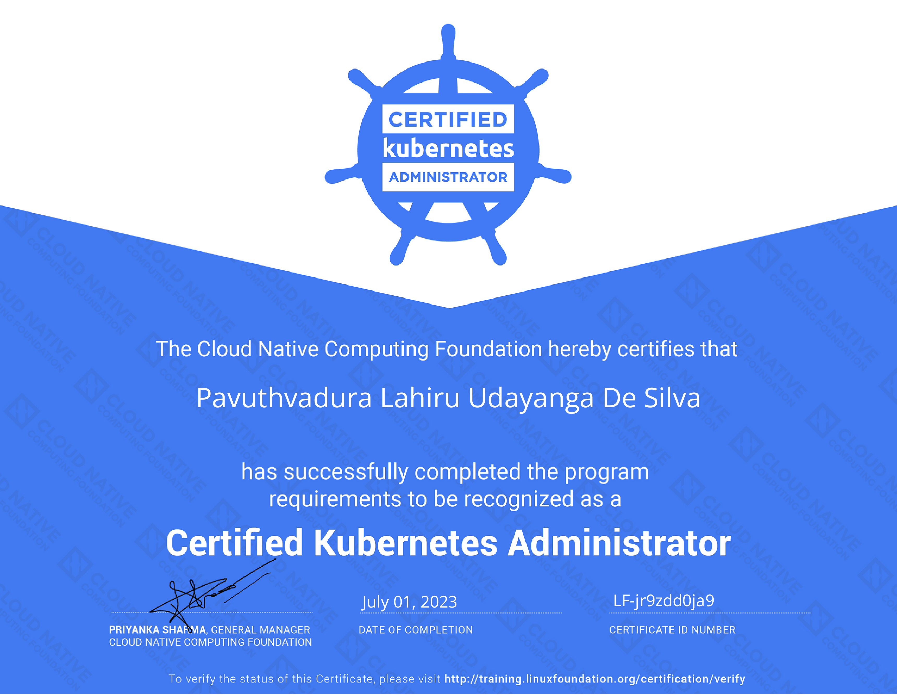

Passing the Certified Kubernetes Administrator (CKA) exam was an exhilarating milestone in my career. In this article, I'll take you through my journey of preparing for and cracking the CKA exam.

I passed the CKA exam in July, 2023 in my first attempt after practising for roughly 4 weeks. I had a good level of Kubernetes experience beforehand the exam practise from my work at the company. I worked on Kubernetes native API gateways for the past 1 year and had a solid understanding about the basic concepts in Kubernetes and how everything works. But there were some missing pieces of the puzzle and I decided to systematically learn the concepts from the beginning by following a course.

## Exam preparation

Regardless of your prior experience working with Kubernetes, I would recommend to purchase a well structured course made in parallel with the CKA syallabus. There are couple of options out there and I chose to go with Mumshad Mannambeth's CKA course on Udemy as it offers access to KodeCloud practise tests which will help you to practise in a real Kubernetes environment and get hands on experience. If you are well experienced in Kubernetes and feel the videos are too lengthty or time consuming, you can complete the practise tests and get an idea about your current state.

After completing the practise tests, you get 3 mock exams and you can try to complete the exams on the given time and check your grade. But these exams are just for you to practise your skills in a provided time limit and do not simulate the actual exam environment or can't be considered as a measure to predict your score in the actual CKA exam.

Once you complete the mock exams in KodeCloud, you can try the Killercoda pratise exercises which are completly free. The playgrounds in Killercoda are much closer to the real environment you get in the real CKA exam and the difficulty of the questions are also more closer to the real CKA exam.

After completing the Killercoda practise scenarios, you can try the Killer.sh mock exams you get with the CKA certification. You get 2 free sessions when you purchase the CKA cerfification. These practise environmemt will be active for 36 hours but the timer will be disabled after the first 120 mins and you'll be graded after that. Try to time for 90 mins and complete all the questions. But keep in mind that the questions on Killer.sh is way more harder than the actual exam and you will be completly fine even if you does not get a passing score. I got 87 out of 120 in my first try which is equivalent to 72.5%. Ideally use your first session before 1 week of the scheduled date of your CKA exam and use the second session like 2 days or 1 day before your scheduled exam.

## Exam questions

You will get somewhere between 15 to 20 questions with different difficulty levels. I got 17 questions and out of them around 6 or 7 of them were difficult like the ones in Killer.sh. Another 6 of the questions were pretty easy and doable within 2 mins. The rest of the questions were like the ones you get in KodeCloud mock exams. I completed all the questions within 90 mins and spend the next 30 mins trying to do 3 of the flagged questions which I wasn't sure what I have done wrong.

## Exam tips and tricks

- First do all the easy and moderate quetions and leave the ones that are difficult and requires more time. You can flag the ones that you have left and come back to them after you finish the easy ones.
- Always keep in mind to switch the K8s context, otherwise even though your answers are correct, you won't get marks
- Use `--dry-run=client -o yaml` to get the K8s manifest as a YAML and edit/add the required info. You can use `export do="--dry-run=client -o yaml"` alias to save time
- Always use imperative way and only use declarative way when it's absoluelty required
- Don't mess up with the namespaces. Sometimes you run a basic command and wonder what's wrong or why the resource is not there.
- Get comfortable with Vim and know the basics like how to write, delete, copy etc.
- Use K8s short names as much as possible
- Delete pods without waiting by using `--force`. You can setup an alias for this also. `export now="--force --grace-period 0"`
- Get familiar with the K8s documentation. Specially Concepts, Tasks and Reference sections. You can always search in the K8s docs.
- Use `kubectl explain` to quickly find the feilds of a certain resource.
- Remember which node and which context you are in before executing the commands.
- Use `kubectl -h` option to get help for the commands and arguments.
- Learn how to do troubleshooting by viewing pod, container and systemd logs. If the kubelet is running in systemd, you'll need to use `journalctl -u kubelet` to view kubelet logs. Know how to restart the kubelet with `systemctl`.
- Practise and be ready to complete trivial tasks like backing up and restoring etcd, creating Network policies, PV & PVC etc.
- Learn how to view processes with `ps` and `netstat`. Also learn how to view network interface details with `ip addr`.

