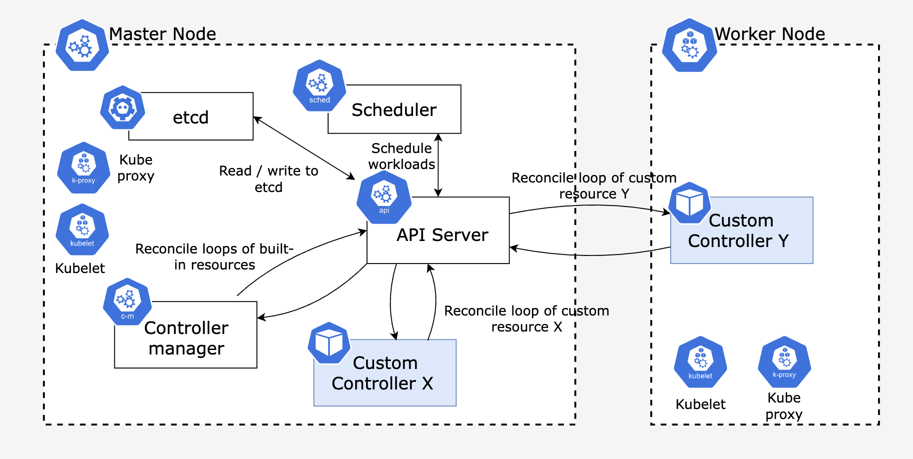

Kubernetes offers a rich ecosystem of [extension points](https://kubernetes.io/docs/concepts/extend-kubernetes/) that allow developers to tailor and extend its functionality. Among these ability to implement Custom Controllers emerge as a powerful mechanism for extending Kubernetes with your own "Kubernetes logic". While there are frameworks and tools like [Kubebuilder](https://github.com/kubernetes-sigs/kubebuilder) and [OperatorSDK](https://sdk.operatorframework.io/) that abstracts away the complexity of implementing custom controllers, understanding how custom controllers operate at a fundamental level is crucial for those who wish to harness the full potential of Kubernetes. In this article, we will go through how custom controllers work behind the scenes and how you can leverage the basic building blocks of custom controllers for your use cases.

## Kubernetes Controller Overview

Controllers serve as the intelligent core or the brain behind Kubernetes by orchestrating and coordinating the lifecycle of resources to ensure the desired state of applications. When resources like Pods, Deployments, Replicasets are created, the relevant controllers respond by performing the required actions to match the current state of the resource with the desired state of the resource.

For instance, consider the scenario of creating a ReplicaSet using kubectl. The ReplicaSet controller promptly detects this action and delegates the task to the kube-scheduler, which schedules the desired number of pods. Once these pods are up and running, the ReplicaSet controller continuously monitors their status through the Kubernetes API server. If, for any reason, a pod terminates unexpectedly, the ReplicaSet controller initiates a request to the kube-scheduler to replace the terminated pod, ensuring that the desired replica count is maintained.

Similarly, Kubernetes ships with a set of built-in controllers packaged within the `kube-controller-manager`. Each of these controllers operates by running a reconcile loop, which continuously ensures the alignment of the current state of the watched resource with its desired state.

```go
for {
  desiredState := getDesiredState()
  currentState := getCurrentState()
  makeChanges(desiredState, currentState)
}
```

<!-- For example, if you create a Replicaset via the `kubectl`, the replication controller will notice this and it will delegate `kube-scheduler` to schedule the desired number of pods. When the pods are up and running, it will continously monitor the status of these pods via the `kube API server`. If a pod get terminated, the replication controller will again ask the `kube-schedular` to schedule a pod to compensate the terminated pod. Similarly Kubernetes is packaged and shipped with built in controllers for the -->

## Kubernetes Custom controllers

It's essential to be familiar with the following terms to understand the concept of custom controllers in Kubernetes.

- **Custom Resources (CRs)** enable you to extend the Kubernetes API and create domain specific objects that are managed by Kubernetes itself like any other built-in objects like Pods, Deployments etc.
- **Custom Resource Definition (CRDs)** are simply a Kubenetes resource type that is used to register your Custom Resources (CRs) with the Kubernetes API server.
- **Custom controllers** extend the functionality of Kubernetes by implementing custom logic for managing Custom Resources (CRs).

So if you want to extend Kubernetes with your own custom logic,

1. Define a Custom Resource Definition (CRD) to let Kubernetes know about your Custom Resources (CRs).
2. Run your own reconcile loop for the custom resource type by implementing a custom controller and deploying it in the Kubernetes cluster.
3. Create Custom Resources (CRs) via a Kubernetes client like `kubectl`.

Following diagram shows how custom controllers fit in with the Kubernetes control plane components and their interactions.



Custom controllers can be deployed as typical Kubernetes deployments.

Now that you have some basic understading about how the Kubernetes custom controllers fit in with other control plane components, let's dig deeper into the internals of a custom controller.

## Building blocks of a Kubernetes custom controller

The internal components of a custom controller can be categorized into **two distinct groups** based on their functionalities and implementation:

### 1. Kubernetes Client Go components (Shared Informer)

- These components are initialized and provided out of the box by the [Kubernetes Go client](https://github.com/kubernetes/client-go).
- The developer implementing the custom controller has to initialize these components via the Shared Informer interface.
- Responsible for watching the Kubernetes API server for resource changes and notifying the event processing components of the custom controller.

**Informer vs Shared Informer**

Evaluating the current state against the desired state requires the controller to interact with the Kubernetes API server to fetch object details. As the number of Kubernetes resources created grows, the frequency of API server calls made by controllers will significantly rise, potentially increasing exponentially. So to reduce the load on the Kubernetes API server, informers or shared informers are introduced.

Informers address this issue by retrieving object data and storing it in the local cache of the controller. The Informer then watches for any create, modify, and delete events that occur afterward. In scenarios where multiple controllers are monitoring a single object, each controller will independently update its local cache. This can result in excessive memory usage and the creation of multiple, potentially inconsistent cache data stores containing object data. This is where the Sharedinformer comes in.

The SharedInformer, as its name implies, is utilized to create a shared cache data store accessible to all controllers, thus resolving the issue of multiple controllers monitoring and updating a single resource or object within the cluster.

Shared informers consist of 4 main components.

1. [Reflector](https://github.com/kubernetes/client-go/blob/master/tools/cache/reflector.go)
2. [Delta FIFO Queue](https://github.com/kubernetes/client-go/blob/master/tools/cache/fifo.go)
3. [Cache controller](https://github.com/kubernetes/client-go/blob/master/tools/cache/controller.go)
4. [Indexer](https://github.com/kubernetes/client-go/blob/master/tools/cache/index.go)

### 2. Custom controller components

- These components are implemented by the developer who's writting the custom controller.
- Responsible for processing the events passed from the Shared Informer.
- Contains the actual reconcilation logic of the custom controller.

Consist of 3 main components.

1. Resource Event handlers.
2. Work Queue.
3. Event processing function (Reconcile)

Now let's see how all these components work together and what tasks each of these components perform to achieve the desired functionality of the custom controller.

## Internal functionality of a Kubernetes custom controller

Following diagram shows the internal interactions between the components of a custom controller and the data flow between the components.


### 1. Reflector watches the Kubernetes API Server using ListAndWatch mechanism.

Reflectors continuously watch the Kubernetes API server for changes in specific resources like Pods, Deployments or Custom Resources and enqueues the Delta FIFO store with events like `Add`, `Update`, `Delete` related to the resources being watched. To perform this, reflectors use the `ListAndWatch` mechanism provided by the Kubernetes API server.

When a reflector is initialized, it starts by listing all the resources it's interested in. This initial listing provides a snapshot of the current state of those resources. After the initial listing, the reflector switches to a watch mode where it establishes a long-lived connection with the API server. The API server then notifies the reflector of any changes to the resources in real-time.

To examine the List and Watch capability of the Kubernetes API server, you can follow the following steps.

- Execute `kubectl proxy` to call the Kubernetes API server without certificates or tokens.
- Execute `curl -s http://localhost:8001/api/v1/namespaces/default/pods` to list all the pods in default namespace.

```json
{
	"kind": "PodList",
	"apiVersion": "v1",
	"metadata": {
		"resourceVersion": "582837"
	},
	"items": []
}
```

- Capture a resource version and execute `curl -s "http://localhost:8001/api/v1/pods?watch=true&resourceVersion=582837"` to watch for pods from a specificed resource version onwards. This will establish a persistence HTTP connection with the Kubernetes API Server and the Kubernetes API server will send the resource updates as chunks.

```sh
curl -s -v "http://localhost:8001/api/v1/pods?watch=true&resourceVersion=587961" -v
*   Trying 127.0.0.1:8001...
* Connected to localhost (127.0.0.1) port 8001 (#0)
> GET /api/v1/pods?watch=true&resourceVersion=587961 HTTP/1.1
> Host: localhost:8001
> User-Agent: curl/8.1.2
> Accept: */*
>
< HTTP/1.1 200 OK
< Audit-Id: 9f25e00a-1d6b-47d6-b818-be84ce7458eb
< Cache-Control: no-cache, private
< Content-Type: application/json
< Date: Sat, 30 Sep 2023 08:33:01 GMT
< X-Kubernetes-Pf-Flowschema-Uid: 2eeceae7-9692-4905-85ba-1ad01882320d
< X-Kubernetes-Pf-Prioritylevel-Uid: 30e13e51-7784-4c62-acb5-b944f96ae4da
< Transfer-Encoding: chunked
```

- Execute `kubectl run nginx --image=nginx` and notice the `CREATE` event received through the other terminal in watch mode.

The received events via the watch are called deltas and the deltas will be enqueued into the [Delta FIFO Queue](https://github.com/kubernetes/client-go/blob/master/tools/cache/delta_fifo.go), which is an incremental first-in first-out queue.

### 2. Delta FIFO Queue stores the resource changes as deltas.

This is a special store that maintains deltas, which is a structure containing the changed object and the type of change.

```go
type Delta struct {
	Type   DeltaType
	Object interface{}
}
```

The Delta objects in the queue will be eventually popped out and processed by the cache controller.

### 3. Cache controller popping deltas and processing deltas

When the cache controller is initiated, [it starts 2 go routines](https://github.com/kubernetes/client-go/blob/6b97f71afcff4f2d6560c79e9e304cc31a8b4ef7/tools/cache/controller.go#L129).

1. Creates a Reflector and runs the reflector in a separate go routine to watch resources in Kubernetes API server.
2. Blocks its main go routine on the [processLoop()](https://github.com/kubernetes/client-go/blob/6b97f71afcff4f2d6560c79e9e304cc31a8b4ef7/tools/cache/controller.go#L186) method which continously pop deltas from the Delta FIFO queue and process deltas.

[processLoop()](https://github.com/kubernetes/client-go/blob/6b97f71afcff4f2d6560c79e9e304cc31a8b4ef7/tools/cache/controller.go#L186) method will invoke [processDeltas()](https://github.com/kubernetes/client-go/blob/6b97f71afcff4f2d6560c79e9e304cc31a8b4ef7/tools/cache/controller.go#L436) method which will perform 2 main functions.

1. Update the indexer according to the detected change retrieved from the delta FIFO queue.
2. Trigger the pre-registered Resource Event Handlers according to the event type. (These are the resource event handlers registered by the developer when creating a SharedInformer. In the resource event handlers, usually only some simple filtering is done, and then the event is added into the Work Queue)

```go
sharedInformer.AddEventHandler(
        &cache.ResourceEventHandlerFuncs{
            AddFunc:    onAdd,
            DeleteFunc: onDelete,
            UpdateFunc: onUpdate,
        })
```

`onAdd`, `onDelete` and `onUpdate` resource event handlers are functions implemented by the developer.

### 4. Resource event handlers enqueue the object key to the work queue

Resource event handlers serve as callback functions that the Shared Informer calls to deliver objects to the controller's event processing functions. The common practice for writing these functions involves retrieving the key associated with the dispatched object (`namespace/name`) and enqueueing that key in the work queue for subsequent processing.

The work queue **decouples the event arrival from processing**, allowing the controller to process events in a controlled and predictable manner, preventing event processing bottlenecks. For example, Shared Informers may operate at different speeds than controller event processing functions, and work queues help prevent the Shared Informer from overloading a slower controller event processor.

### 5. Dequeueing events from the work queue and reconciliation

Event processing functions are the functions that you implement in your code to process items from the work queue. There can be one or more other functions that do the actual processing.

These functions will typically use the Indexer to retrieve the object corresponding to the key and perform the actual event processing logic you have implemented.

Multiple go routines can be spawned to process event updates and each of these worker go routines will call `processNextWorkItem` which will dequeue object keys from the work queue and call `syncHandler` method to perform reconcilation logic.

Depending on the reconcilation logic, you may need to call the Kubernetes API server or any other external services. And mostly importantly, once the reconciliation logic is performed, the status of the resource should be updated and typically the performed actions is added into the Events array.

If you are using a framework like [Kubebuilder](https://github.com/kubernetes-sigs/kubebuilder) or [OperatorSDK](https://sdk.operatorframework.io/), this is the point where you write reconciliation logic inside the `Reconcile()` method of the generated controller code.

## Summary

In summary, the following sequence of events take place inside the Kubernetes custom controller.

1. Reflector watches Kubernetes API server and add resource changes (deltas) to Delta FIFO Queue.
2. Cache controller pops these changes out from the Delta FIFO Queue and update the indexer.
3. Cache controller trigger the pre-registered resource event handlers.
4. Pre-registered resource event handlers filters the events and add the object keys to the work queue.
5. Custom controller event processing functions pops out the object keys, retrieve the object using the keys from the indexer and perform reconcilation logic.
6. After performing reconcilation logic, custom controller updates the status of the object by calling the Kubernetes API server.

Now to get started with implementing a custom controller, you can use this [sample controller](https://github.com/kubernetes/sample-controller) from the Kubernetes community as the starting point.
