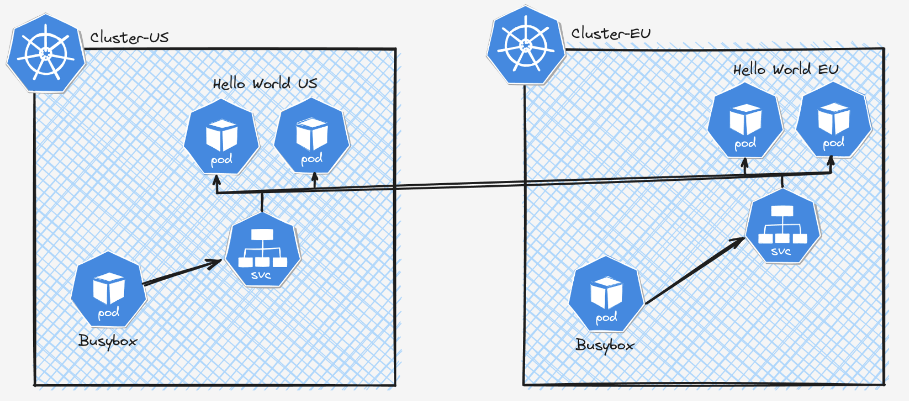
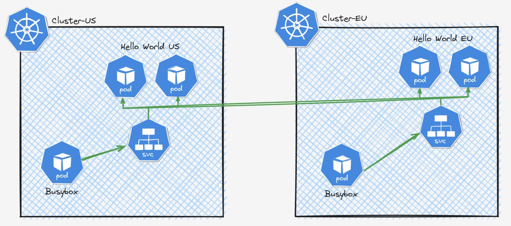
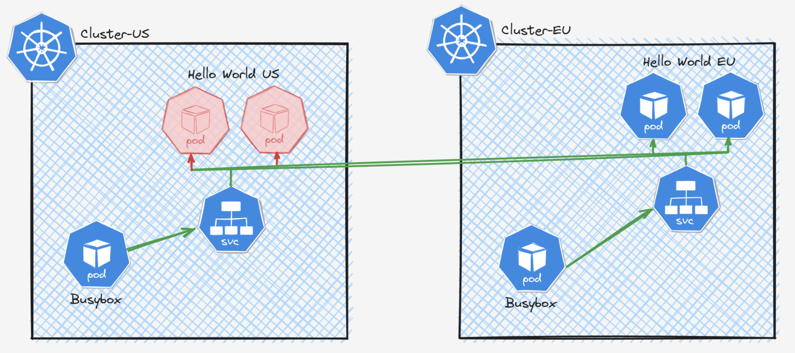

As organizations increasingly adopt distributed architectures and scale their Kubernetes deployments, the need for robust networking and security solutions that can seamlessly operate across multiple clusters becomes paramount. In this blog, we will go through how you can use Cilium Cluster Mesh to effectively manage a fleet of Kubernetes clusters spanning across availability zones or regions, thereby achieving unparalleled levels of high availability and fault tolerance across your infrastructure.

## Cilium Cluster Mesh in a nutshell 🐝

Cilium Cluster Mesh allows you to connect the networks of multiple clusters in such as way that pods in each cluster can discover and access services in all other clusters of the mesh, provided all the clusters run Cilium as their CNI. This allows effectively joining multiple clusters into a large unified network, regardless of the Kubernetes distribution or location each of them is running.

This is done by deploying an additional API server called `clustermesh-apiserver` to synchronize the shared state among the kubernetes clusters. Each kubernetes cluster holds its state in the etcd and the kubernetes clusters in the cluster mesh can access other cluster's state via the `clustermesh-apiserver`. For this each cluster should expose its `clustermesh-apiserver` as a Load balancer service. Cilium agents running in the kubernetes clusters connect to the `clustermesh-apiserver` of other clusters, watch for changes and replicate the multi-cluster relevant state into their own cluster.

Cilium Cluster Mesh provides the following features as stated in the Cilium documentation.

- Pod IP routing across multiple Kubernetes clusters at native performance via tunneling or direct-routing without requiring any gateways or proxies.
- Transparent service discovery with standard Kubernetes services and coredns/kube-dns.
- Network policy enforcement spanning multiple clusters. Policies can be specified as Kubernetes NetworkPolicy resource or the extended CiliumNetworkPolicy CRD.
- Transparent encryption for all communication between nodes in the local cluster as well as across cluster boundaries.

## Time to get our hands dirty.... 👨‍🔧

In this blog, we are going to deploy the following setup in your laptop using `kind (Kubernetes IN Docker)` and demonstrate the multi cluster load balancing and fault tolerance capabilities supported by Cilium Cluster Mesh.

The setup consists of 2 kubernetes clusters which are named as US and EU for ease of relating to real world scenario of multi region clusters. We are going to install Cilium in both of the clusters and then enable Cilium Cluster Mesh on both. Then we are going to deploy a hello world application in both of the clusters along with a busybox pod to access the application within the cluster. Then we are going to make the hello world service accessible across clusters enabling load balancing across clusters. Finally we are going to use service affinity rules in Cilium to demonstrate the fault tolerant capabilities across clusters.



### 1. Create two kubernetes clusters using kind.

> Note: We will be using 3 terminals for the hands on lab. Terminal 1 has access to the US cluster and the Terminal 2 has access to the EU cluster. Terminal 3 has access to the both clusters.

- Create a new directory to host the kubernetes manifests. Let's name it as `cilium-cluster-mesh`.
- Open a terminal session (Terminal 1) and set the environment variable `KUBECONFIG` to `export KUBECONFIG=./kubeconfig-us.yaml`
- Create a file with the following content and save it as `kind-us-cluster.yaml`

```yaml
---
apiVersion: kind.x-k8s.io/v1alpha4
kind: Cluster
networking:
  disableDefaultCNI: true
  podSubnet: 10.1.0.0/16
  serviceSubnet: 172.20.1.0/24
nodes:
  - role: control-plane
    extraPortMappings:
      - containerPort: 32042
        hostPort: 32042
      - containerPort: 31234
        hostPort: 31234
      - containerPort: 31235
        hostPort: 31235
  - role: worker
  - role: worker
```

- Execute the following command to create the US cluster. If the cluster creation is successful, following logs can be seen.

```sh
# US cluster (Terminal 1)
➜ kind create cluster --name us --config kind-us-cluster.yaml

Creating cluster "us" ...
 ✓ Ensuring node image (kindest/node:v1.27.3) 🖼
 ✓ Preparing nodes 📦 📦 📦
 ✓ Writing configuration 📜
 ✓ Starting control-plane 🕹️
 ✓ Installing StorageClass 💾
 ✓ Joining worker nodes 🚜
Set kubectl context to "kind-us"
You can now use your cluster with:

kubectl cluster-info --context kind-us

Not sure what to do next? 😅  Check out https://kind.sigs.k8s.io/docs/user/quick-start/

```

- Next open a new terminal (Terminal 2) and set the environment variable `KUBECONFIG` to `export KUBECONFIG=./kubeconfig-eu.yaml`
- Create a file with the following content and save it as `kind-eu-cluster.yaml`

```yaml
---
apiVersion: kind.x-k8s.io/v1alpha4
kind: Cluster
networking:
  disableDefaultCNI: true
  podSubnet: 10.2.0.0/16
  serviceSubnet: 172.20.2.0/24
nodes:
  - role: control-plane
  - role: worker
  - role: worker
```

- Execute the following command to create the EU cluster. If the cluster creation is successful, following logs can be seen.

```sh
# EU cluster (Terminal 2)
➜ kind create cluster --name eu --config kind-eu-cluster.yaml

Creating cluster "eu" ...
 ✓ Ensuring node image (kindest/node:v1.27.3) 🖼
 ✓ Preparing nodes 📦 📦 📦
 ✓ Writing configuration 📜
 ✓ Starting control-plane 🕹️
 ✓ Installing StorageClass 💾
 ✓ Joining worker nodes 🚜
Set kubectl context to "kind-eu"
You can now use your cluster with:

kubectl cluster-info --context kind-eu

Not sure what to do next? 😅  Check out https://kind.sigs.k8s.io/docs/user/quick-start/

```

### 2. Install Cilium CNI in the two clusters.

- In the terminal 1 (US), execute the following command to install the Cilium CNI in the US cluster.

```sh
# US cluster (Terminal 1)
cilium install \
  --set cluster.name=us \
  --set cluster.id=1 \
  --set ipam.mode=kubernetes

🔮 Auto-detected Kubernetes kind: kind
✨ Running "kind" validation checks
✅ Detected kind version "0.20.0"
ℹ️  Using Cilium version 1.15.4
ℹ️  Using cluster name "eu"
🔮 Auto-detected kube-proxy has been installed
```

- Execute the command `cilium status` to check the status of the Cilium installation.

```sh
# US cluster (Terminal 1)
➜ cilium status
    /¯¯\
 /¯¯\__/¯¯\    Cilium:             OK
 \__/¯¯\__/    Operator:           OK
 /¯¯\__/¯¯\    Envoy DaemonSet:    disabled (using embedded mode)
 \__/¯¯\__/    Hubble Relay:       disabled
    \__/       ClusterMesh:        disabled

Deployment             cilium-operator    Desired: 1, Ready: 1/1, Available: 1/1
DaemonSet              cilium             Desired: 3, Ready: 3/3, Available: 3/3
Containers:            cilium             Running: 3
                       cilium-operator    Running: 1
Cluster Pods:          3/3 managed by Cilium
Helm chart version:
Image versions         cilium             quay.io/cilium/cilium:v1.15.4@sha256:b760a4831f5aab71c711f7537a107b751d0d0ce90dd32d8b358df3c5da385426: 3
                       cilium-operator    quay.io/cilium/operator-generic:v1.15.4@sha256:404890a83cca3f28829eb7e54c1564bb6904708cdb7be04ebe69c2b60f164e9a: 1
```

- In the terminal 2 (EU), execute the following command to install the Cilium CNI in the EU cluster.

```sh
# EU cluster (Terminal 2)
cilium install \
  --set cluster.name=eu \
  --set cluster.id=2 \
  --set ipam.mode=kubernetes

🔮 Auto-detected Kubernetes kind: kind
✨ Running "kind" validation checks
✅ Detected kind version "0.20.0"
ℹ️  Using Cilium version 1.15.4
ℹ️  Using cluster name "eu"
🔮 Auto-detected kube-proxy has been installed
```

Now if you followed the instructions upto this point correctly, you would have 2 kubernetes clusters up and running in your laptop with Cilium installed as the CNI.

### 3. Enable Cilium Cluster Mesh in both clusters

Next we are going to enable Cilium Cluster Mesh in both US and EU clusters. This will deploy an additional deployment for the `clustermesh-apiserver` in both of the clusters.

Cilium agents running in the EU cluster will use this `clustermesh-apiserver` in the US cluster to replicate the states of US cluster to its own EU cluster and vice versa. Therefore this `clustermesh-apiserver` should be exposed as a Load balancer service for accessing outside the cluster. But for demonstrating purposes, we are going to expose the `clustermesh-apiserver` as a NodePort service as we don't have dynamic load balancers available. This is not recommended for production use cases as the service becomes unavailable when the node goes down.

To enable `clustermesh-apiserver` run the following command in both Terminal 1 (US) and Terminal 2 (EU).

```sh
# US cluster (Terminal 1) & EU cluster (Terminal 2)
cilium clustermesh enable --service-type NodePort
```

If you execute the `cilium status` command now, you'll notice that the `ClusterMesh` status is changed from `disabled` to `OK`.

```sh
# US cluster (Terminal 1) & EU cluster (Terminal 2)
➜ cilium status
    /¯¯\
 /¯¯\__/¯¯\    Cilium:             OK
 \__/¯¯\__/    Operator:           OK
 /¯¯\__/¯¯\    Envoy DaemonSet:    disabled (using embedded mode)
 \__/¯¯\__/    Hubble Relay:       OK
    \__/       ClusterMesh:        OK

DaemonSet              cilium                   Desired: 3, Ready: 3/3, Available: 3/3
Deployment             clustermesh-apiserver    Desired: 1, Ready: 1/1, Available: 1/1
Deployment             hubble-relay             Desired: 1, Ready: 1/1, Available: 1/1
Deployment             hubble-ui                Desired: 1, Ready: 1/1, Available: 1/1
Deployment             cilium-operator          Desired: 1, Ready: 1/1, Available: 1/1
Containers:            cilium-operator          Running: 1
                       cilium                   Running: 3
                       hubble-relay             Running: 1
                       hubble-ui                Running: 1
                       clustermesh-apiserver    Running: 1
Cluster Pods:          6/6 managed by Cilium
Helm chart version:
Image versions         cilium                   quay.io/cilium/cilium:v1.15.4@sha256:b760a4831f5aab71c711f7537a107b751d0d0ce90dd32d8b358df3c5da385426: 3
                       hubble-relay             quay.io/cilium/hubble-relay:v1.15.4@sha256:03ad857feaf52f1b4774c29614f42a50b370680eb7d0bfbc1ae065df84b1070a: 1
                       hubble-ui                quay.io/cilium/hubble-ui:v0.13.0@sha256:7d663dc16538dd6e29061abd1047013a645e6e69c115e008bee9ea9fef9a6666: 1
                       hubble-ui                quay.io/cilium/hubble-ui-backend:v0.13.0@sha256:1e7657d997c5a48253bb8dc91ecee75b63018d16ff5e5797e5af367336bc8803: 1
                       clustermesh-apiserver    quay.io/cilium/clustermesh-apiserver:v1.15.4@sha256:3fadf85d2aa0ecec09152e7e2d57648bda7e35bdc161b25ab54066dd4c3b299c: 2
                       cilium-operator          quay.io/cilium/operator-generic:v1.15.4@sha256:404890a83cca3f28829eb7e54c1564bb6904708cdb7be04ebe69c2b60f164e9a: 1
```

Now if you execute `kubectl get pods -A`, you'll notice a new pod is created for the `clustermesh-apiserver`.

```sh
# US cluster (Terminal 1) & EU cluster (Terminal 2)
➜ kubectl get pods -A

NAMESPACE            NAME                                         READY   STATUS      RESTARTS   AGE
kube-system          cilium-5glrm                                 1/1     Running     0          4m8s
kube-system          cilium-operator-5d8fb68868-sn9k5             1/1     Running     0          4m8s
kube-system          cilium-rnpmp                                 1/1     Running     0          4m8s
kube-system          cilium-tfjwr                                 1/1     Running     0          4m8s
kube-system          clustermesh-apiserver-68b6c7cc6d-224tw       0/2     Init:0/1    0          14s
kube-system          clustermesh-apiserver-generate-certs-hmpdc   0/1     Completed   0          14s
kube-system          coredns-5d78c9869d-d8drc                     1/1     Running     0          6m36s
kube-system          coredns-5d78c9869d-f85p5                     1/1     Running     0          6m36s
kube-system          etcd-us-control-plane                        1/1     Running     0          6m50s
kube-system          hubble-relay-64d7c9bb65-zwcfk                1/1     Running     0          79s
kube-system          hubble-ui-7b4457996f-pzhtf                   2/2     Running     0          79s
kube-system          kube-apiserver-us-control-plane              1/1     Running     0          6m52s
kube-system          kube-controller-manager-us-control-plane     1/1     Running     0          6m49s
kube-system          kube-proxy-nfmw2                             1/1     Running     0          6m30s
kube-system          kube-proxy-pmgnx                             1/1     Running     0          6m36s
kube-system          kube-proxy-twjbc                             1/1     Running     0          6m29s
kube-system          kube-scheduler-us-control-plane              1/1     Running     0          6m49s
local-path-storage   local-path-provisioner-6bc4bddd6b-qxk2z      1/1     Running     0          6m36s
```

If you followed everything upto to this point, you would have 2 kubernetes clusters with Cilium installed as the CNI and clustermesh enabled in both the clusters. Next we need to connect the two clusters.

### 4. Connect the two clusters

To connect the two clusters, we need to use the global terminal with access to both the clusters. (Terminal 3)

- Open the terminal 3 and execute the following command to merge the two contexts of the US and EU clusters.

```sh
# Global terminal (Terminal 3)
KUBECONFIG=./kubeconfig-us.yaml:./kubeconfig-eu.yaml
kubectl config view --flatten > merged-kubeconfig.yaml
```

- Next set the `KUBECONFIG` to the newly created merged kubeconfig.

```sh
# Global terminal (Terminal 3)
export KUBECONFIG=./merged-kubeconfig.yaml
```

- Finally execute the following command to connect the two clusters.

```sh
# Global terminal (Terminal 3)
➜ cilium clustermesh connect \
  --context kind-us \
  --destination-context kind-eu
✨ Extracting access information of cluster eu...
🔑 Extracting secrets from cluster eu...
⚠️  Service type NodePort detected! Service may fail when nodes are removed from the cluster!
ℹ️  Found ClusterMesh service IPs: [172.18.0.7]
✨ Extracting access information of cluster us...
🔑 Extracting secrets from cluster us...
⚠️  Service type NodePort detected! Service may fail when nodes are removed from the cluster!
ℹ️  Found ClusterMesh service IPs: [172.18.0.4]
⚠️ Cilium CA certificates do not match between clusters. Multicluster features will be limited!
ℹ️ Configuring Cilium in cluster 'kind-us' to connect to cluster 'kind-eu'
ℹ️ Configuring Cilium in cluster 'kind-eu' to connect to cluster 'kind-us'
✅ Connected cluster kind-us and kind-eu!

```

To check the status of the Cilium Cluster Mesh execute the command `cilium clustermesh status`. You would see an output like the following if everything is working as expected.

```sh
# US cluster (Terminal 1) & EU cluster (Terminal 2)
➜ cilium clustermesh status
⚠️  Service type NodePort detected! Service may fail when nodes are removed from the cluster!
✅ Service "clustermesh-apiserver" of type "NodePort" found
✅ Cluster access information is available:
  - 172.18.0.4:32379
✅ Deployment clustermesh-apiserver is ready
✅ All 3 nodes are connected to all clusters [min:1 / avg:1.0 / max:1]
🔌 Cluster Connections:
  - eu: 3/3 configured, 3/3 connected
🔀 Global services: [ min:0 / avg:0.0 / max:0 ]
```

### 5. Deploy the sample hello world application

Deploy the sample hello world application by executing the following commands in each of Terminal 1 (US) and Terminal 2(EU).

```sh
# US cluster (Terminal 1)
kubectl apply -f deployment-us.yaml

# EU cluster (Terminal 2)
kubectl apply -f deployment-eu.yaml
```

Check whether sample hello world is working as expected by executing the following command in both US and EU clusters to invoke the hello world service from the busybox pod.

```sh
# US cluster (Terminal 1)
➜ kubectl exec -it busybox-deployment-b7bc87c95-t4z2c -- /bin/sh -c 'for i in $(seq 1 10); do wget -qO- hello-world:80; echo ""; done'

{"message": "Hello world from US!"}
{"message": "Hello world from US!"}
{"message": "Hello world from US!"}
{"message": "Hello world from US!"}
{"message": "Hello world from US!"}
{"message": "Hello world from US!"}
{"message": "Hello world from US!"}
{"message": "Hello world from US!"}
{"message": "Hello world from US!"}
{"message": "Hello world from US!"}

# EU cluster (Terminal 2)
➜ kubectl exec -it busybox-deployment-b7bc87c95-xhc6l -- /bin/sh -c 'for i in $(seq 1 10); do wget -qO- hello-world:80; echo ""; done'

{"message": "Hello world from Europe!"}
{"message": "Hello world from Europe!"}
{"message": "Hello world from Europe!"}
{"message": "Hello world from Europe!"}
{"message": "Hello world from Europe!"}
{"message": "Hello world from Europe!"}
{"message": "Hello world from Europe!"}
{"message": "Hello world from Europe!"}
{"message": "Hello world from Europe!"}
{"message": "Hello world from Europe!"}
```

Did you notice that all the responses in the US are returned from the hello world service in US ? And all the responses in the EU are returned from the hello world service in EU ? Eventhough we have enabled Cilium Cluster Mesh in both clusters and connected the two clusters, we haven't enabled the hello world service as a global service. So the requests are load balanced among the pods within the same cluster.

### 6. Enable hello world service as a global service to enable cross cluster service discovery and load balancing.

To enable hello world service as a global service, execute the following command in both US and EU clusters.



```sh
# US cluster (Terminal 1) & EU cluster (Terminal 2)
kubectl annotate service hello-world service.cilium.io/global="true"
```

Now invoke the hello world service again and notice the responses received.

```sh
# US cluster (Terminal 1)
➜ kubectl exec -it busybox-deployment-b7bc87c95-t4z2c -- /bin/sh -c 'for i in $(seq 1 10); do wget -qO- hello-world:80; echo ""; done'

{"message": "Hello world from US!"}
{"message": "Hello world from Europe!"}
{"message": "Hello world from Europe!"}
{"message": "Hello world from Europe!"}
{"message": "Hello world from Europe!"}
{"message": "Hello world from US!"}
{"message": "Hello world from Europe!"}
{"message": "Hello world from Europe!"}
{"message": "Hello world from US!"}
{"message": "Hello world from Europe!"}

# EU cluster (Terminal 2)
➜ kubectl exec -it busybox-deployment-b7bc87c95-xhc6l -- /bin/sh -c 'for i in $(seq 1 10); do wget -qO- hello-world:80; echo ""; done'

{"message": "Hello world from Europe!"}
{"message": "Hello world from Europe!"}
{"message": "Hello world from US!"}
{"message": "Hello world from Europe!"}
{"message": "Hello world from US!"}
{"message": "Hello world from Europe!"}
{"message": "Hello world from Europe!"}
{"message": "Hello world from US!"}
{"message": "Hello world from Europe!"}
{"message": "Hello world from Europe!"}
```

Now you can see that the requests from the US cluster are load balanced to US and EU and vice versa. Tadaaa!!! We have successfully enabled cross cluster service discovery and load balacing using Cilium Cluster Mesh.

Now in an ideal scenario, we want to load balance globally for fault tolerance only if the local services are not available. Load balancing cross cluster is not ideal always as the latency may get higher comapared to local services. To achive such behaviour, we can use the service affinity rules in Cilium.

### 7. Specify hello world service affinity as local for fault tolerant cross cluster load balancing.

Execute the following command to specify the hello world service affinity as `local` in the US cluster. This will load balance requests to the hello world service among the pods in the US cluster only and route requests to the other cluster (EU) **only if** the local service is not available.

```sh
# US cluster (Terminal 1)
kubectl annotate service hello-world service.cilium.io/affinity="local"
```

Now if you invoke the hello world service from the US cluster, you will receive responses only from the hello world service in the US cluster.

```sh
# US cluster (Terminal 1)
➜ kubectl exec -it busybox-deployment-b7bc87c95-t4z2c -- /bin/sh -c 'for i in $(seq 1 10); do wget -qO- hello-world:80; echo ""; done'

{"message": "Hello world from US!"}
{"message": "Hello world from US!"}
{"message": "Hello world from US!"}
{"message": "Hello world from US!"}
{"message": "Hello world from US!"}
{"message": "Hello world from US!"}
{"message": "Hello world from US!"}
{"message": "Hello world from US!"}
{"message": "Hello world from US!"}
{"message": "Hello world from US!"}
```

To demonstrate the fault tolerant behaviour, scale down the hello world service in US cluster and invoke the hello world service from the US cluster.

```sh
# US cluster (Terminal 1)
kubectl scale deployment hello-world --replicas 0
```

```sh
# US cluster (Terminal 1)
➜ kubectl exec -it busybox-deployment-b7bc87c95-t4z2c -- /bin/sh -c 'for i in $(seq 1 10); do wget -qO- hello-world:80; echo ""; done'

{"message": "Hello world from Europe!"}
{"message": "Hello world from Europe!"}
{"message": "Hello world from Europe!"}
{"message": "Hello world from Europe!"}
{"message": "Hello world from Europe!"}
{"message": "Hello world from Europe!"}
{"message": "Hello world from Europe!"}
{"message": "Hello world from Europe!"}
{"message": "Hello world from Europe!"}
{"message": "Hello world from Europe!"}
```



Eventhough the hello world service is down in the US, the requests get routed to the hello world service in EU making it fault tolerant across clusters.

So we have successfully demonstrated the multi cluster service discovery, load balancing and fault tolerance that can be achieved with Cilium Cluster Mesh using two kubernetes clusters running locally in your laptop.

**Kubernetes manifests used for the hands on lab:** [cilium-cluster-mesh](https://github.com/NomadXD/samples/tree/main/cilium-cluster-mesh)

## References

- [Cilium Multi-cluster Networking](https://docs.cilium.io/en/stable/network/clustermesh/)
- [Deep Dive into Cilium Multi-cluster](https://cilium.io/blog/2019/03/12/clustermesh/)
- [KIND cluster configuration](https://kind.sigs.k8s.io/docs/user/configuration/)
