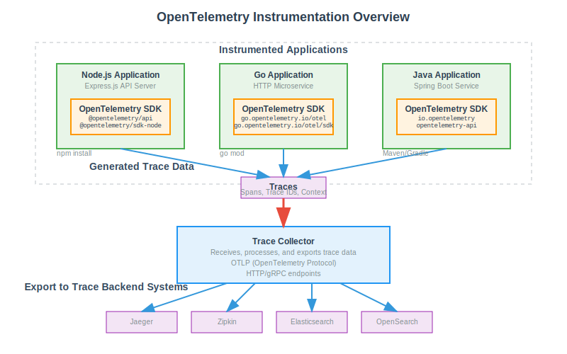
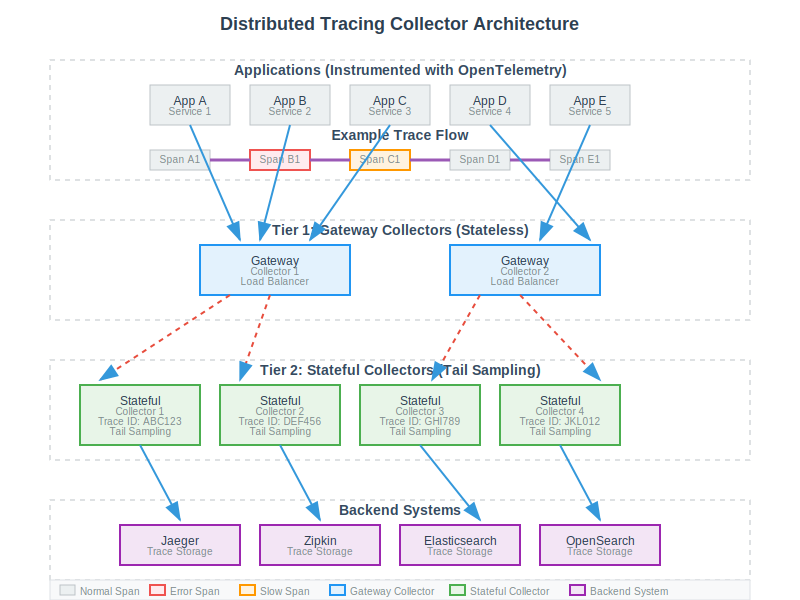
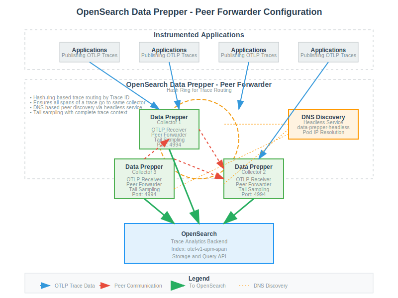
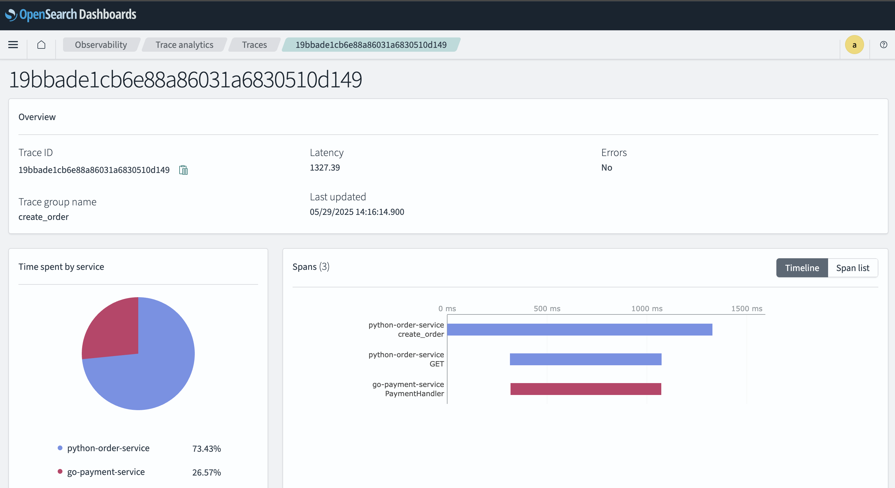

As modern applications are increasingly built on a foundation of cloud-native infrastructure and microservices, the simplicity of monolithic debugging has given way to a new era of distributed complexity. When a single user request can trigger a cascade of calls across dozens of services, how do you find the root cause of a slowdown or an error? Traditional monitoring tools often fall short, leaving developers in the dark. This is precisely the problem that distributed tracing was designed to solve. By stitching together the entire lifecycle of a request as it hops across services, it provides the end-to-end visibility crucial for maintaining performance and reliability. This article will guide you through the architectural patterns and core components needed to build a robust distributed tracing infrastructure for your own cloud-native ecosystem.

## Core components of a distributed tracing system

The foundation of a distributed tracing system consists of four essential components.

### 1. Instrumentation

This is the process of integrating code into applications to generate and emit trace data. This data usually takes the form of "spans," which represent individual units of work (e.g., an HTTP request or a database call). Each span includes a unique Span ID, the Trace ID of the overall request it belongs to, start and end timestamps, and other contextual metadata (tags or attributes).

[Context propagation](https://opentelemetry.io/docs/concepts/context-propagation/) ensures that the Trace ID and parent Span ID are passed along as requests flow between services, allowing the reconstruction of the entire trace. [OpenTelemetry SDKs](https://opentelemetry.io/docs/languages/) are the current industry standard for application instrumentation.


_Figure 1: Application instrumentation using OpenTelemetry SDKs_

#### OpenTelemetry (OTel)

[OpenTelemetry (OTel)](https://opentelemetry.io/) has emerged as the leading open standard for observability, regulated by the Cloud Native Computing Foundation (CNCF). It is a vendor neural approach for application instrumentation. It provides a unified set of APIs, SDKs, data formats (like OTLP), and tools for generating, collecting, and exporting telemetry data—specifically traces, metrics, and logs.

#### Zero-code / automatic instrumentation

[Zero-code instrumentation](https://opentelemetry.io/docs/concepts/instrumentation/zero-code/) adds the OpenTelemetry API and SDK capabilities to your application typically as an agent or agent-like installation. The specific mechanisms involved may differ by language, ranging from bytecode manipulation, monkey patching, or eBPF to inject calls to the OpenTelemetry API and SDK into your application. Zero-code instrumentation adds instrumentation for the libraries used by an application. This means that requests and responses, database calls, message queue calls, and so forth are what are instrumented.
Application code is not typically instrumented. To instrument application code, code-based instrumentation should be used.

#### Code-based / manual instrumentation

[Code-based instrumentation](https://opentelemetry.io/docs/concepts/instrumentation/code-based/) provides deeper insights and visibility into applications itself in contrast to the zero-code instrumentation. Code-based instrumentation requires developers to add OpenTelemetry SDKs to application code and configure to export telemetry data. Also when the application code is instrumented, the libraries will also automatically export trace data depending on the language specific SDKs and the OpenTelemetry support in the used libraries.

#### Head sampling

[Head sampling](https://opentelemetry.io/docs/concepts/sampling/#head-sampling) is a sampling technique used to make a sampling decision as early as possible. A decision to sample or drop a span or trace is not made by inspecting the trace as a whole. Head sampling is usually performed at the client side and is a stateless operation.

The main purpose of head sampling is to reduce the volume of trace data in high-throughput systems that generate large amounts of telemetry. By making early sampling decisions, head sampling safeguards the collector tier from overload and helps prevent excessive data from reaching the OpenSearch storage layer, ensuring both scalability and cost efficiency.

[OpenTelemetry SDK built-in samplers](https://opentelemetry.io/docs/specs/otel/trace/sdk/#built-in-samplers) can be used to enforce head sampling at the client side by injecting the following environment variables into the applications.

- OTEL_TRACES_SAMPLER - `always_on`, `always_off`, `traceidratio`, `parentbased_always_on`, `parentbased_always_off`, `parentbased_traceidratio`
- OTEL_TRACES_SAMPLER_ARG - percentage value [0..1]

### 2. Collection

Collectors, often deployed as agents running alongside applications or as standalone gateway services, are responsible for receiving telemetry data from instrumented applications. They can perform processing tasks such as batching, filtering, sampling, and attribute enrichment before exporting the data to a backend system.

In the context of distributed tracing, tail sampling and rate limiting are the most prominent use cases of collectors. Tail sampling at the collector level is crucial to filter out the events that are meaningful and have more value for troubleshooting application issues like events with errors, higher latencies etc.


_Figure 2: Sampling traces with important data for troubleshooting_

#### Tail Sampling

[Tail sampling](https://opentelemetry.io/docs/concepts/sampling/#tail-sampling) is where the decision to sample a trace takes place by considering all or most of the spans within the trace. Tail sampling gives you the option to sample your traces based on specific criteria derived from different parts of a trace, which isn’t an option with Head sampling.

Tail sampling is done by considering all or most of the spans within the trace and hence this is a stateful operation. **This causes a well known limitation with scaling these stateful collectors as applications publishing spans of a trace to multiple collectors will cause fragmented traces.** The solution to solve this problem involves a 2 tier collector architecture where the _Tier 1_ load balances all the spans of a trace to a single collector instance in the _Tier 2_ based on the Trace ID.


_Figure 3: 2-Tier Trace Collector Architecture_

#### Rate Limiting

Rate limiting at the collector level acts as a critical safety measure for distributed tracing infrastructure. By enforcing limits on the rate of incoming traces, collectors can prevent overload and protect downstream systems—including storage backends and visualization tools—from excessive traffic during unexpected incidents, such as application bugs or traffic spikes. This not only helps maintain system stability but also reduces operational costs by avoiding unnecessary ingestion and storage of trace data that may result from accidental or malicious events. Implementing rate limiting policies ensures that your tracing pipeline remains resilient and cost-effective, even under adverse conditions.

### 3. Backend (Sink)

The backend represents the persistence layer of the distributed tracing system. It serves as the terminal sink for all processed telemetry from the collection tier and is engineered to perform the essential functions of data storage, retrieval, and indexing that underpin long-term analysis.

A robust tracing backend must perform three primary functions:

1. **Long-term storage:** It must persistently store vast quantities of trace data, making it available for historical analysis, performance trend identification, Service Level Objective (SLO) tracking, and regulatory compliance.
2. **Indexing:** To facilitate rapid data retrieval, the backend must create and maintain efficient indexes on key trace and span attributes. This includes indexing by service name, operation name, duration, timestamps, and any custom attributes (tags) that are critical for analysis. The quality of this indexing directly determines the power and performance of the query system.
3. **Query API:** It must expose a powerful and flexible API that allows visualization tools and human operators to query the stored trace data, enabling the exploration, filtering, and aggregation required for effective troubleshooting and analysis.

Today's open-source ecosystem offers a spectrum of powerful tracing backends beyond just one or two solutions. Leading projects like Jaeger, Grafana Tempo, Signoz, and Zipkin each represent a distinct set of design choices and priorities. For instance, the architectural philosophies of Jaeger and Tempo are fundamentally different, tailored for vastly different use cases regarding data querying, scalability, and cost.

For organizations that prefer to buy a solution rather than build and manage one, commercial observability platforms offer tracing as a core feature of a broader, managed service. These platforms abstract away the immense complexity of operating a scalable backend. Key players include Datadog, New Relic, Dynatrace and Splunk.

### 4. Visualization

The final and most human-centric component of a distributed tracing system is the visualization layer. Raw trace data, which can consist of millions of individual spans, is essentially a stream of structured text that is impossible for a human operator to interpret directly. The visualization layer's critical function is to transform this overwhelming volume of data into intuitive, interactive graphical representations. This transformation is what enables engineers to rapidly comprehend complex system behavior, identify performance bottlenecks, and accelerate the debugging of failures.

Several distinct visualization paradigms have become standard for presenting trace data, each offering a different perspective on system performance.

- **Gantt / Waterfall Charts:** This is the most fundamental and widely used visualization for analyzing a single trace. It presents the trace as a cascading timeline of horizontal bars, where each bar represents a single span. The left-to-right position of a bar indicates its start time and its relationship to other spans, while its length is proportional to its duration. This view is exceptionally effective for latency analysis; the longest bars in the chart immediately draw the eye to the operations that are consuming the most time, providing an instant visual cue to the source of a slowdown.
- **Service Dependency Graphs:** This provides a high-level, aggregated view of the entire distributed system's architecture. By analyzing a large number of traces, the visualization tool constructs a topological map where nodes represent individual services and directed edges represent the calls between them. These graphs are typically annotated with key health metrics, such as request throughput (requests per second), error rate, and p99 latency for each inter-service connection. This macro-level view is invaluable for understanding service dependencies, visualizing the potential "blast radius" of a failing component, and getting a quick, at-a-glance overview of the system's overall health.
- **Flame Graphs:** While visually similar to a Gantt chart, a flame graph serves a different purpose: profiling. It aggregates many traces or spans with the same operation name and stacks them vertically to show which code paths are most frequently executed or are consuming the most time across a large sample of requests. The width of each block in the graph is proportional to its contribution to the total time, making it a powerful tool for identifying inefficient code paths within a single service.

## Reference implementation

> **Prerequisites**:
>
> - Access to a Kubernetes cluster
> - Helm CLI
> - Add the OpenSearch Helm charts repository:
>
>   ```sh
>   helm repo add opensearch https://opensearch-project.github.io/helm-charts
>   helm repo update
>   ```
>
>   See: https://opensearch-project.github.io/helm-charts

This section provides a practical guide for building an end to end distributed tracing system using Opensearch stack. This include Opensearch DataPrepper as the trace collector, Opensearch as the trace sink and Opensearch Trace Analytics plugin with Opensearch Dashboards for trace visualization.

### Deploy Opensearch single node

For ease of use, demonstration purposes, and because there is no tracing-specific dependency with the OpenSearch deployment, we are using a single node deployment. This is not recommended for production use cases.

```sh
helm install opensearch opensearch/opensearch -f https://raw.githubusercontent.com/NomadXD/samples/refs/heads/main/opensearch-distributed-tracing/values-opensearch.yaml --namespace opensearch-stack --create-namespace
NAME: opensearch
LAST DEPLOYED: Tue Jul 29 20:48:58 2025
NAMESPACE: opensearch-stack
STATUS: deployed
REVISION: 1
TEST SUITE: None
NOTES:
Watch all cluster members come up.
  $ kubectl get pods --namespace=opensearch-stack -l app.kubernetes.io/component=opensearch-local-dev-master -w
```

### Deploy Opensearch Dashboards

Deploy Opensearch dashboard and configure it to connect to the Opensearch single node deployment.

```sh
helm install opensearch-dashboard opensearch/opensearch-dashboards -f https://raw.githubusercontent.com/NomadXD/samples/refs/heads/main/opensearch-distributed-tracing/values-opensearch-dashboard.yaml --namespace opensearch-stack
NAME: opensearch-dashboard
LAST DEPLOYED: Wed Jul 30 10:55:57 2025
NAMESPACE: opensearch-stack
STATUS: deployed
REVISION: 1
TEST SUITE: None
NOTES:
1. Get the application URL by running these commands:
  export POD_NAME=$(kubectl get pods --namespace opensearch-stack -l "app.kubernetes.io/name=opensearch-dashboards,app.kubernetes.io/instance=opensearch-dashboard" -o jsonpath="{.items[0].metadata.name}")
  export CONTAINER_PORT=$(kubectl get pod --namespace opensearch-stack $POD_NAME -o jsonpath="{.spec.containers[0].ports[0].containerPort}")
  echo "Visit http://127.0.0.1:8080 to use your application"
  kubectl --namespace opensearch-stack port-forward $POD_NAME 8080:$CONTAINER_PORT
```

### Deploy Opensearch DataPrepper

Instead of deploying a single node of the Opensearch DataPrepper, multiple nodes are deployed in the peer forwarder configuration to demonstrate the scaling capabilities of the Opensearch DataPrepper.


_Figure 4: Opensearch DataPrepper Peer Forwarder Configuration_

The Peer Forwarder component in OpenSearch Data Prepper logically implements the 2 Tier collector architecture commonly used for scalable distributed tracing. While the classic model describes a Tier 1 that load balances spans and a Tier 2 that performs tail sampling, Peer Forwarder achieves this in a peer-to-peer fashion: Data Prepper nodes communicate directly with each other, using a hash-ring approach to aggregate events and ensure all spans for a given trace are routed to the same node for sampling and processing. This design provides the benefits of load balancing and stateful trace aggregation without explicit tier separation.

For peer discovery, Data Prepper supports DNS-based configuration, where a DNS provider returns a list of Data Prepper hosts for a given domain name. In Kubernetes environments, this is typically implemented using a headless service, which exposes the individual pod IPs via DNS A records, allowing Data Prepper nodes to discover and communicate with all peers in the cluster.

1. Initially deploy the Opensearch DataPrepper nodes without peer forwarding as we will face the _Chicken and Egg problem_ if we try to deploy in peer forwader configuration at once. The reason for that is because upon startup the dataprepper nodes will try to connect to other peers using the provided domain name and since every other node will wait for others to start up, this causes a deadlock. To mitigate that scenario, first let's deploy the dataprepper nodes without peer forwarding.

```sh
helm install opensearch-data-prepper opensearch/data-prepper -f https://raw.githubusercontent.com/NomadXD/samples/317e716c4ec3f3d2d846ef2f268d7fcefab7eb94/opensearch-distributed-tracing/values-opensearch-dataprepper.yaml --version 0.3.1 --namespace opensearch-stack
I0730 13:26:13.197723   68838 warnings.go:110] "Warning: spec.template.spec.containers[0].ports[5]: duplicate port definition with spec.template.spec.containers[0].ports[4]"
NAME: opensearch-data-prepper
LAST DEPLOYED: Wed Jul 30 13:26:12 2025
NAMESPACE: opensearch-stack
STATUS: deployed
REVISION: 1
TEST SUITE: None
NOTES:
1. Get the application URL by running these commands:
  export POD_NAME=$(kubectl get pods --namespace opensearch-stack -l "app.kubernetes.io/name=data-prepper,app.kubernetes.io/instance=opensearch-data-prepper" -o jsonpath="{.items[0].metadata.name}")
  export CONTAINER_PORT=$(kubectl get pod --namespace opensearch-stack $POD_NAME -o jsonpath="{.spec.containers[0].ports[0].containerPort}")
  echo "Visit http://127.0.0.1:8080 to use your application"
  kubectl --namespace opensearch-stack port-forward $POD_NAME 8080:$CONTAINER_PORT
Inline pipeline configuration is enabled. Please refer to the values.yaml file for the configuration.
```

2. Create a Headless service for the DataPrepper peers to connect with each other.

```yaml
apiVersion: v1
kind: Service
metadata:
  name: data-prepper-headless
  namespace: opensearch-stack
spec:
  clusterIP: None
  selector:
    app.kubernetes.io/instance: opensearch-data-prepper
    app.kubernetes.io/name: data-prepper
  ports:
    - name: peer-forwarder
      port: 4994
      targetPort: 4994
      protocol: TCP
```

3. Configure Opensearch DataPrepper to run in peer forwarder configuration.

```sh
helm upgrade opensearch-data-prepper opensearch/data-prepper -f https://raw.githubusercontent.com/NomadXD/samples/ca9a5e0c17cd479e40064fb490a22292c022db64/opensearch-distributed-tracing/values-opensearch-dataprepper.yaml --namespace opensearch-stack
I0730 13:37:09.117548   73798 warnings.go:110] "Warning: spec.template.spec.containers[0].ports[5]: duplicate port definition with spec.template.spec.containers[0].ports[4]"
Release "opensearch-data-prepper" has been upgraded. Happy Helming!
NAME: opensearch-data-prepper
LAST DEPLOYED: Wed Jul 30 13:37:08 2025
NAMESPACE: opensearch-stack
STATUS: deployed
REVISION: 2
TEST SUITE: None
NOTES:
1. Get the application URL by running these commands:
  export POD_NAME=$(kubectl get pods --namespace opensearch-stack -l "app.kubernetes.io/name=data-prepper,app.kubernetes.io/instance=opensearch-data-prepper" -o jsonpath="{.items[0].metadata.name}")
  export CONTAINER_PORT=$(kubectl get pod --namespace opensearch-stack $POD_NAME -o jsonpath="{.spec.containers[0].ports[0].containerPort}")
  echo "Visit http://127.0.0.1:8080 to use your application"
  kubectl --namespace opensearch-stack port-forward $POD_NAME 8080:$CONTAINER_PORT
Inline pipeline configuration is enabled. Please refer to the values.yaml file for the configuration.
```

### Analyse trace data using Opensearch Dashboard

Now that you have a complete end-to-end distributed tracing system running, you can instrument your applications with OpenTelemetry SDKs and configure them to publish traces to the Opensearch Data Prepper OTLP trace endpoint. Once traces are flowing, you can use Opensearch Dashboards Trace Analytics to visualize, search, and analyze your distributed traces in real time.


_Figure 5: Opensearch Dashboard Trace Analytics_

---

**Helm Charts values.yaml:**
[Opensearch Distributed Tracing Helm Charts](https://github.com/NomadXD/samples/tree/main/opensearch-distributed-tracing)
