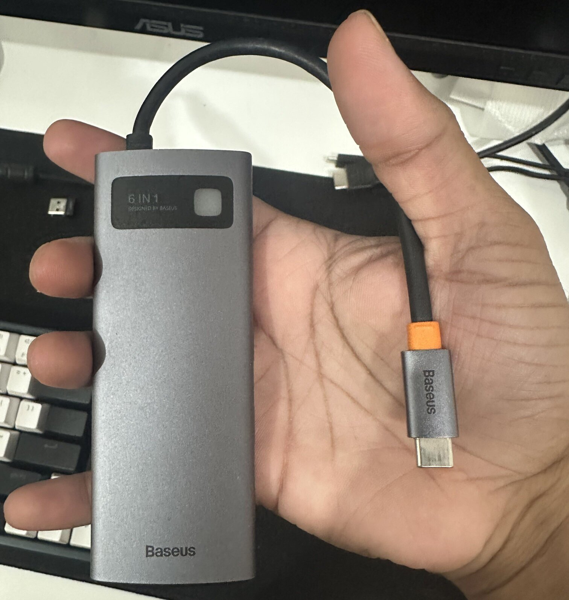
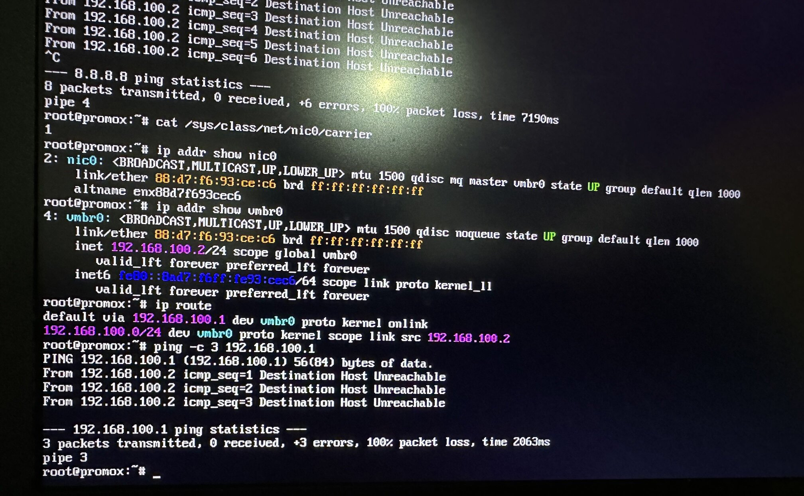
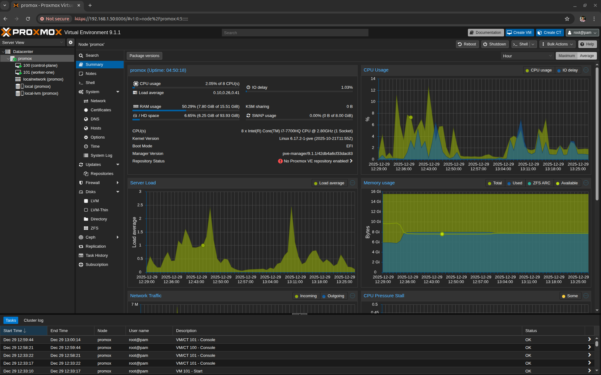

What began as a simple idea - *"let me reuse my old gaming laptop as a Kubernetes homelab"*, turned into a series of interesting challenges. On paper, the plan was straightforward: install Proxmox, spin up a couple of virtual machines, bootstrap a Kubernetes cluster using Kubeadm, and call it a day. In reality, the process became a deep dive through Linux kernel headers, broken network drivers, offline package installs, and typical networking subnet issues.

## Setup, Objectives & Motivation

**The Setup:** A decade-old gaming laptop with an Intel Core i7 processor with 4 cores and 16 GB RAM (ASUS ROG GL 753VD with Intel Core i7-7700HQ @ 3.80 GHz).

**The Objective:**
- Run Proxmox VE as the base hypervisor
- Deploy 2-3 virtual machines
- Build a multi-node Kubernetes cluster using kubeadm

**The Motivation:**
- A local environment for testing CNIs, K8s configs, linux networking etc.
- To prepare for the upcoming CKS exam by doing the course labs in the local cluster
- Turn a retired gaming laptop covered with dust into something useful

## Proxmox Installation - Secure Boot Was Not the Real Problem

I started with a clean Proxmox VE installation using a USB flash drive as described in the [official docs](https://pve.proxmox.com/wiki/Prepare_Installation_Media#installation_prepare_media). The installation went smoothly, but after rebooting, Proxmox failed to boot properly with the following error.

```
Could not create MokListTrustedRT: Volume full
Something has gone seriously wrong: import_mok_state() failed: Volume Full
```

For context, MOK (Machine Owner Key) entries are cryptographic keys used by bootloaders to verify signed kernel modules when Secure Boot is enabled. They're typically stored in EFI NVRAM and allow users to trust custom or third-party drivers that aren't signed by the hardware vendor.

At first glance, this made no sense. Secure Boot was already disabled in BIOS.

I investigated the issue further and discovered the root cause: even with Secure Boot disabled, stale MOK (Machine Owner Key) entries were still present in EFI NVRAM from previous OS installations. These leftover entries were confusing the boot chain and filling up the NVRAM storage, preventing Proxmox from storing its own boot variables.

The solution was performing a hard reset for NVRAM. I powered off the machine, held the power button for approximately 30 seconds to perform a NVRAM reset, then booted again. This forces the BIOS to re-initialize the NVRAM variables. On many ASUS motherboards, this clears out temporary "garbage" entries in the UEFI storage, freeing up just enough space for the MokList to be created so you could boot again. 

After this reset, all the stale entries were cleared, and Proxmox booted cleanly without any issues.

## Network Interfaces are DOWN

After installation, Proxmox came up BUT networking didn't.

This turned out to be the major issue that consumed most of my troubleshooting time. I initially tried bringing the interfaces up manually, but nothing worked. After digging through ChatGPT responses, Google searches, and various Proxmox forums, I finally uncovered the root cause.

Proxmox 9 uses Debian 13 under the hood, which defaults to the `r8169` kernel module (maintained by the Linux kernel team) for Realtek Ethernet controllers. Unfortunately, this module has compatibility issues with certain Realtek hardware. The solution was to use the `r8168` module instead, which is maintained directly by Realtek and provides better hardware support.

The challenge? Without a working network connection, I needed to perform an offline installation of the `r8168` module and blacklist the `r8169` kernel module to prevent it from loading.

## Offline Dependency Hell

From another machine with internet access, I downloaded the following `.deb` packages:

### 1. proxmox-headers-6.17.2-1-pve_amd64.deb

This provides the kernel headers for the exact Proxmox kernel I was running. These headers describe the internal APIs of the kernel and are mandatory for compiling any out-of-tree kernel module. Without them, the driver simply cannot be built.

### 2. dkms_3.2.2-1~deb13u1_all.deb

This installs the Dynamic Kernel Module Support (DKMS) framework.

DKMS is responsible for:
- Building kernel modules from source
- Integrating them with the running kernel
- Rebuilding them automatically when the kernel changes

In short, DKMS is the glue between driver source code and the kernel.

### 3. r8168-dkms_8.055.00-1_all.deb


This contains the Realtek r8168 driver source code, along with DKMS metadata.

This package does not ship a precompiled driver. Instead, it provides:
- The driver source
- Build instructions (`dkms.conf`)
- Hooks that tell DKMS how to compile it into a `.ko` module

When installed, DKMS uses this package to compile the actual kernel driver.

```sh
r8168-dkms.deb
   │
   ├── driver source code
   ├── dkms.conf
   │
   ▼
DKMS
   │
   ├── uses kernel headers
   ├── runs make
   │
   ▼
r8168.ko
   │
   ▼
Kernel module loaded
```

I copied the three required `.deb` packages onto a USB flash drive, mounted it on the Proxmox host, and attempted to install them using dpkg. As I suspected, the installation quickly failed due to unresolved dependencies, which couldn't be fetched because the system was completely offline.

This is where I paused and reassessed the situation and eventually looked for a temporary way to get internet access, just long enough to fix the driver properly.

## A Temporary Network Lifeline

At this point, I asked ChatGPT for alternatives to get temporary internet access on the Proxmox host, just long enough to fix the broken NIC driver properly.

Two options came up:
- USB tethering using a mobile phone
- A USB to Ethernet adapter

I decided to try them in that order.

### USB Tethering

I started with USB tethering, hoping it would be the quickest path forward. The interface did show up on the system, but it was in a `DOWN` state. I tried to bring it up manually, and it transitioned from `DOWN` to `UNKNOWN`, but there was still no sign of connectivity - ping attempts failed completely.

After hours of debugging already behind me, this felt like yet another rabbit hole. At that point, I made a call to stop digging.

### The USB Adapter That Saved the Day

I was feeling hopeless at this point and almost ready to call it off for the day. But then I suddenly remembered something I'd completely forgotten about; the Baseus 6-in-1 USB-C adapter sitting in my bag.

It has an Ethernet port. Ironically, this was something my coworkers and I had joked about at the office before. None of us could quite justify why a USB adapter would even need an Ethernet port, especially in a world dominated by Wi-Fi. Turns out, this was exactly why.

I plugged the adapter into the laptop, connected an Ethernet cable, and within seconds the interface came up cleanly, obtained an IP address, and for the first time, the Proxmox host had stable internet access. No weird logs. No half-working interfaces. It just worked.



Unlike the onboard Realtek NIC, the USB Ethernet adapter uses a completely different chipset and driver, one that's well-supported by the Linux kernel out of the box (most adapters use ASIX or AX88179 chip, which are supported in kernels ≥5.x).

That clean, temporary network connection was all I needed to:
- Perform a system update
- Install dkms, pve kernel headers and realtek r8168 driver

After installing the `r8168` driver, I blacklisted the built-in `r8169` driver to prevent it from loading and performed a reboot. After the reboot, finally, the `nic0` and `vmbr0` (Proxmox bridge) interfaces came up successfully.

## Bridge Network Subnet Mismatch

After fixing the Realtek driver and finally getting `nic0` into an UP state, I expected networking to just work. It didn’t.
- The interface was up.
- The bridge was up.
- The link carrier was detected.

And yet nothing could reach the outside world. At first glance, everything looked healthy:
- `nic0` showed UP
- `vmbr0` showed UP

But basic connectivity checks failed. A closer look at the routing configuration revealed the real issue.



The Proxmox host was configured for the `192.168.100.0/24` subnet. However, my actual home network - the router, DHCP server, and other devices lived on `192.168.1.0/24`.

In other words:
- The bridge was working perfectly just on the wrong network.
- The system was trying to reach a gateway that didn’t exist.

### Why This Happened

During the initial Proxmox installation, I accepted the default network configuration. At the time, the `nic0` wasn’t working, so there was no immediate feedback that anything was wrong.

Once the driver issue was fixed, the misconfiguration surfaced:
- `vmbr0` had a static IP in a non-existent subnet
- The gateway pointed to an unreachable address
- ARP requests never received replies

This is a particularly nasty class of issue because:
- Interfaces appear healthy
- No errors are logged
- Everything looks correct unless you verify the subnet end-to-end.

The solution was straightforward once the problem was clear. I updated the bridge configuration to match my actual LAN in `/etc/network/interfaces`.

```
auto lo
iface lo inet loopback

iface nic0 inet manual

auto vmbr0
iface vmbr0 inet static
    address 192.168.1.50/24
    gateway 192.168.1.1
    bridge-ports nic0
    bridge-stp off
    bridge-fd 0
```

After restarting the network service with `systemctl restart networking`:
- The gateway responded
- Internet access worked
- The Proxmox web UI became reachable from other machines in the LAN

## Spinning Up the Kubernetes Cluster

With the Proxmox host finally stable and reachable over the LAN, the rest of the setup felt refreshingly straightforward.

From another machine on the same network, I accessed the Proxmox Web UI and created two virtual machines, both running Ubuntu 22.04:

Control Plane
- 2 vCPUs
- 4 GB RAM

Worker Node
- 1 vCPU
- 2 GB RAM



Both VMs were attached to the same bridge interface `vmbr0`, allowing them to behave like first-class citizens on the local network.

### Bootstrapping Kubernetes

Once the VMs were up, I used `kubeadm` to initialize the Kubernetes control plane and join the worker node to the cluster. With the networking issues behind me, the cluster came up cleanly and behaved exactly as expected.

Pods could communicate, services resolved correctly, and the environment finally felt “boringly stable”.

### Headroom for Growth

Even after provisioning the 2 VMs, Proxmox itself was only using about half of the available memory. That leaves plenty of headroom to:
- Add another worker node
- Experiment with multi-node or multi-cluster setups
- Run additional infrastructure components alongside Kubernetes

Not bad for a decade old laptop after all !!!

## References

- [unable to install r8168-dkms for Realtek NIC](https://forum.proxmox.com/threads/unable-to-install-r8168-dkms-for-realtek-nic.137727/?utm_source=chatgpt.com)
- [[New Installation] Proxmox 8.0 - Network interfaces down and cannot be brought up](https://forum.proxmox.com/threads/new-installation-proxmox-8-0-network-interfaces-down-and-cannot-be-brought-up.130519/)
- [Driver Problem with r8169 Network Card after Kernel Update](https://forum.proxmox.com/threads/driver-problem-with-r8169-network-card-after-kernel-update.135302/)
- [Networking issues PVE8](https://forum.proxmox.com/threads/networking-issues-pve8.129742/)
- [USB Tethering for proxmox host](https://forum.proxmox.com/threads/usb-tethering-for-proxmox-host.166388/)