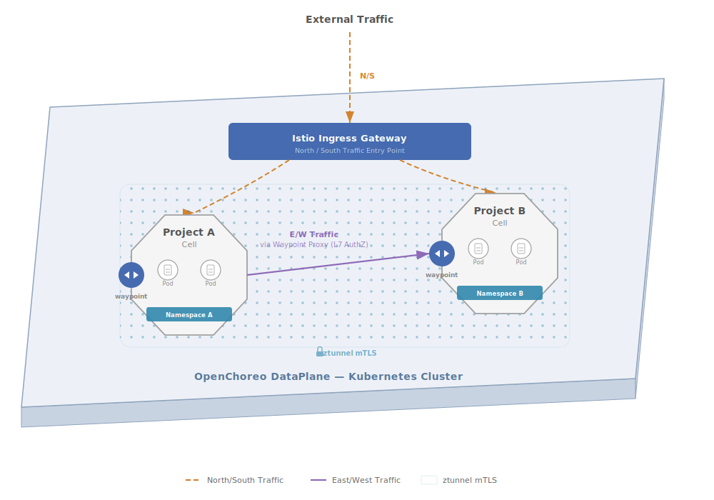
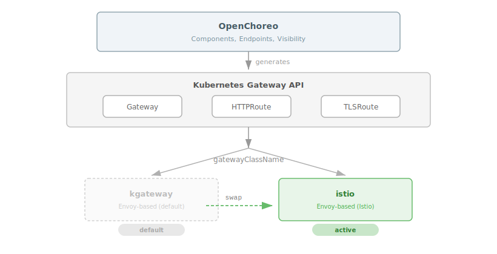
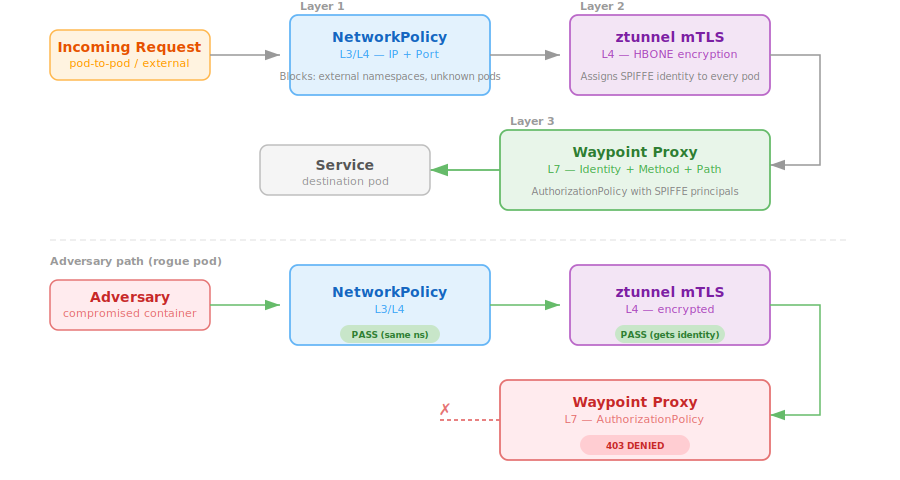
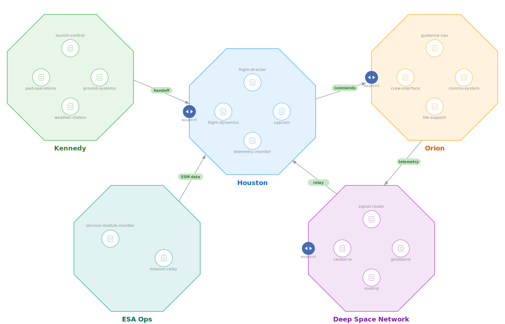
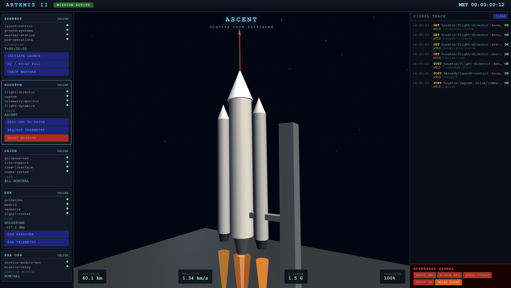
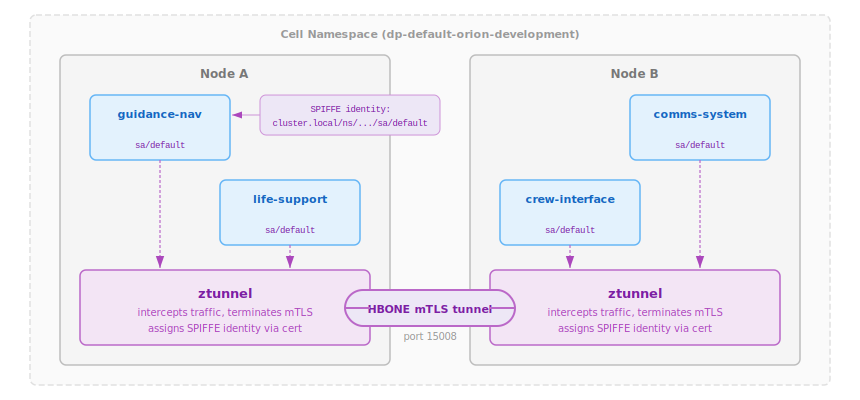
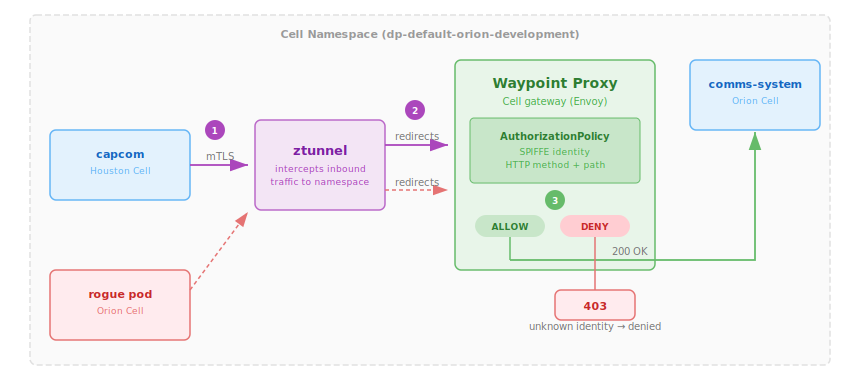

## Introduction

[OpenChoreo](https://openchoreo.dev) is an open-source Internal Developer Platform (IDP) for Kubernetes that recently joined the [CNCF as a sandbox project](https://openchoreo.dev/blog/openchoreo-joins-cncf-and-ships-1-0/). It provides high-level abstractions such as Projects, Components, Endpoints that compile down to Kubernetes resources, letting developers focus on their applications while platform engineers govern the infrastructure.

One of the most powerful architectural concepts in OpenChoreo is the **Cell**, which is a secure isolated runtime boundary inspired by Domain-Driven Design and [Cell-Based Architecture](https://github.com/wso2/reference-architecture/blob/master/reference-architecture-cell-based.md). Each OpenChoreo Project becomes a Cell at runtime: a dedicated Kubernetes namespace with NetworkPolicies that govern ingress/egress traffic of the Cell.

OpenChoreo currently uses standard Kubernetes NetworkPolicies for Cell isolation, which operate at L3/L4. They control _which pods can talk to which pods (and on which ports)_, but not _what HTTP requests are allowed_. What if a container inside the Cell is compromised? What if a rogue pod can reach your services but shouldn't be able to call specific endpoints? NetworkPolicies can't distinguish a legitimate `POST /api/orders` from a malicious `DELETE /api/users`.

This is where **Istio Ambient Mesh** comes in. Istio ambient mesh can handle the full networking layer beneath OpenChoreo, managing both north/south traffic (external ingress/egress via the Istio Gateway API implementation) and east/west traffic (service-to-service communication via ztunnel mTLS and waypoint proxies). It provides transparent encryption and L7 authorization without sidecars, layering perfectly on top of OpenChoreo Cells.



Together, they create a zero trust networking stack where:

- **OpenChoreo Cells** define _what is isolated_ (namespace boundaries with NetworkPolicies at L3/L4)
- **Istio Gateway** handles _north/south traffic_ (external ingress via the standard Gateway API)
- **Istio ztunnel** secures _east/west traffic_ (mTLS encryption with SPIFFE identities for all pod-to-pod communication)
- **Istio waypoint proxies** enforce _what requests are allowed_ (L7 authorization with identity, method, and path)

## Why Istio Ambient Mesh Is a Natural Fit for OpenChoreo

### The Cell-Waypoint Alignment

OpenChoreo Cell architecture maps remarkably well to Istio ambient architecture:

| OpenChoreo Concept  | Istio Ambient Equivalent                         | What It Does                                      |
| ------------------- | ------------------------------------------------ | ------------------------------------------------- |
| **Project (Cell)**  | Namespace with `istio.io/dataplane-mode=ambient` | Defines the isolation boundary                    |
| **Cell networking** | ztunnel mTLS                                     | Encrypts all traffic both within and across Cells |
| **Cell gateway**    | Waypoint proxy                                   | Enforces L7 policies at the Cell entrance         |
| **Component**       | Pod with SPIFFE identity                         | Has a cryptographic identity for authorization    |

The key insight is that OpenChoreo already creates one namespace per _Project-Environment_ combination. When you label that namespace for ambient mesh enrollment, ztunnel automatically encrypts all _pod-to-pod_ traffic with mTLS. Deploy a waypoint proxy in the namespace, and it becomes the Cell gateway evaluating AuthorizationPolicies before any request reaches your services.

### Why Ambient, Not Sidecars?

Istio ambient mode (ztunnel + waypoint) is a better fit for OpenChoreo than traditional sidecar injection:

1. **No pod mutation** — OpenChoreo manages pod specs through its rendering pipeline. Sidecar injection would require adding an OpenChoreo Trait, losing the transparent encryption and mTLS becomes a developer concern instead of a platform default. Ambient needs only a namespace label.
2. **Namespace-level enrollment** — OpenChoreo already manages namespace lifecycle per Cell. Labeling the namespace enrolls all pods automatically.
3. **Separation of concerns** — ztunnel handles L4 mTLS for all pods, waypoints add L7 only where needed. This cleanly separates responsibilities: platform engineers get encryption everywhere by default, while developers define fine-grained L7 authorization policies based on their business requirements.
4. **Lower resource overhead** — One ztunnel DaemonSet instead of a sidecar per pod.

### Using the Standard Kubernetes Gateway API

OpenChoreo generates `Gateway` and `HTTPRoute` resources using the standard Kubernetes Gateway API. Istio implements the Kubernetes Gateway API via its `istio` GatewayClass. This means you can swap the default gateway implementation ([kgateway](https://kgateway.dev/)) for Istio by changing a single value:

```yaml
# Data plane Helm values
gateway:
  gatewayClassName: istio # instead of "kgateway"
```

The developer experience doesn't change at all. They still declare endpoints with visibility levels, and the platform handles routing. Istio Envoy-based gateway processes the same HTTPRoutes that kgateway would.



## From Network Isolation to Zero Trust Cells

OpenChoreo Cells already provide strong isolation. Each Project gets its own namespace with NetworkPolicies that restrict which pods can talk to which pods on which ports. But NetworkPolicies operate at L3/L4. They answer _"can this IP reach that port?"_, not _"should this identity be allowed to call that endpoint?"_. And all traffic inside the Cell travels as **plaintext**. Any process that can sniff the network can read every request.

Adding Istio ambient mesh transforms Cells from network-isolated boundaries into **zero trust boundaries**:

### What Changes

|                              | **OpenChoreo Cell (default)**                   | **OpenChoreo Cell + Istio Ambient**                                         |
| ---------------------------- | ----------------------------------------------- | --------------------------------------------------------------------------- |
| **Traffic encryption**       | Plaintext (unencrypted)                         | mTLS via ztunnel (HBONE)                                                    |
| **Identity model**           | IP-based (source pod IP)                        | Cryptographic SPIFFE identity per ServiceAccount                            |
| **Network policy**           | L3/L4 NetworkPolicies (port + IP)               | L3/L4 NetworkPolicies + L7 AuthorizationPolicies (identity + method + path) |
| **Intra-cell visibility**    | Any pod in the namespace can reach any port     | Any pod can connect, but waypoint enforces identity-based access            |
| **Cross-cell authorization** | Allowed/denied by namespace-level NetworkPolicy | Allowed/denied by SPIFFE identity + HTTP method + path                      |
| **Compromised container**    | Full access to all services in the Cell         | Blocked — unknown identity is implicitly denied                             |

### The Three Layer Defense

These layers are _additive, not replacements_. A request must pass all three to reach a service:

1. **OpenChoreo NetworkPolicies (L3/L4)** — The perimeter. Controls which namespaces and pods can establish connections. Blocks external traffic that shouldn't reach the Cell at all.

2. **Istio ztunnel (L4 mTLS)** — The encryption layer. Every pod-to-pod connection is wrapped in mTLS via the [HBONE protocol](https://istio.io/latest/docs/ambient/architecture/hbone/). Each pod gets a **SPIFFE identity** (`cluster.local/ns/<namespace>/sa/<service-account>`) which is a cryptographic certificate that proves _who_ is making the request, not just _where_ the request comes from.

3. **Istio waypoint proxy (L7 authorization)** — The policy enforcement point. Deployed per-namespace, the waypoint acts as the Cell gateway. It evaluates `AuthorizationPolicy` rules that match on SPIFFE identity, HTTP method, and path before forwarding traffic to the destination service.

| Layer                            | Blocks                                | Passes                                                              |
| -------------------------------- | ------------------------------------- | ------------------------------------------------------------------- |
| **OpenChoreo NetworkPolicy**     | External namespaces, unknown pods     | Same-namespace traffic, declared dependencies                       |
| **Istio ztunnel (mTLS)**         | Unencrypted traffic                   | All traffic (encrypted), assigns SPIFFE identity                    |
| **Istio Waypoint (AuthzPolicy)** | Unknown identities, wrong method/path | Only requests from authorized identities to permitted methods/paths |

A rogue pod deployed within the Cell passes Layer 1 (same namespace) and Layer 2 (gets encrypted with its own identity), but is **implicitly denied at Layer 3** as its SPIFFE identity doesn't match any ALLOW rule. Even if an existing pod is compromised, the attacker is constrained to only the methods and paths that pod's identity is authorized for.



## NASA Artemis II Lunar mission demo

To demonstrate the power of OpenChoreo + Istio Ambient Mesh, a simulated NASA Artemis II mission was built with 5 OpenChoreo Projects (Cells) containing 18 microservices:

### Mission Entities as Cells

| Cell (Project)         | Components                                                      | Role                                                     |
| ---------------------- | --------------------------------------------------------------- | -------------------------------------------------------- |
| **Houston**            | flight-director, capcom, telemetry-monitor, flight-dynamics     | Mission control — commands, decisions, telemetry         |
| **Kennedy**            | launch-control, ground-systems, weather-station, pad-operations | Launch operations at LC-39B                              |
| **Orion**              | guidance-nav, life-support, crew-interface, comms-system        | The spacecraft — navigation, crew health, communications |
| **Deep Space Network** | signal-router, goldstone, madrid, canberra                      | Global antenna array — signal relay                      |
| **ESA Ops**            | service-module-monitor, mission-relay                           | European Service Module monitoring                       |

Each Project becomes a Cell at runtime which is an isolated namespace with its own NetworkPolicies:

```yaml
apiVersion: openchoreo.dev/v1alpha1
kind: Project
metadata:
  name: orion
  namespace: default
spec:
  deploymentPipelineRef:
    name: default
```

Components are deployed as services inside each Cell:

```yaml
apiVersion: openchoreo.dev/v1alpha1
kind: Component
metadata:
  name: guidance-nav
  namespace: default
spec:
  owner:
    projectName: orion
  autoDeploy: true
  componentType:
    kind: ClusterComponentType
    name: deployment/service
```

### Artemis II Cell Architecture



Each Cell communicates only with the Cells its mission role demands. No more, no less:

- **Houston → Orion**: CAPCOM uplinks commands to the spacecraft comms-system
- **Orion → DSN → Houston**: Telemetry flows through the Deep Space Network back to mission control
- **Kennedy → Houston**: Launch control hands off to the flight director after liftoff
- **ESA → Houston**: The European Service Module monitor relays health data to mission control

The demo includes a mission control dashboard where you can simulate adversaries, observe how each defense layer responds, and neutralize threats in real time to see zero trust networking in action.



## A Rogue Pod Inside the Cell

A rogue pod gets deployed inside the Orion Cell namespace. Maybe an attacker gained access to the cluster through a misconfigured RBAC role, a leaked kubeconfig, or a CI/CD pipeline vulnerability. The pod runs with its own ServiceAccount and has full network access within the namespace.

As OpenChoreo NetworkPolicies operate at L3/L4, they can't distinguish a legitimate `POST /uplink` from CAPCOM versus a malicious one from a rogue pod.

Without additional security, it can:

1. **Abort the mission** — `POST /decision/abort` to Houston flight-director
2. **Hijack navigation** — `POST /maneuver` to Orion guidance-nav, sending the spacecraft off course
3. **Steal classified crew data** — `GET /crew/vitals` from Orion life-support
4. **Send fake commands** — `POST /uplink` to Orion comms-system, impersonating CAPCOM

```
$ curl -X POST http://guidance-nav:8080/maneuver
{"status":"acknowledged","type":"course-correction","deltaV":"2.3 m/s"}
# 200 OK. No questions asked.
```

## Securing the Mission with Istio Ambient

### Layer 1: Encrypt with ztunnel (mTLS + SPIFFE identities)

Label each Cell namespace to enroll in the ambient mesh:

```bash
kubectl label namespace <cell-namespace> istio.io/dataplane-mode=ambient
```

This does two things:

1. **Encrypts all traffic** between pods using mTLS via the [HBONE protocol](https://istio.io/latest/docs/ambient/architecture/hbone/)
2. **Assigns SPIFFE identities** to every pod based on its ServiceAccount

After enrollment, every pod gets a cryptographic identity: `cluster.local/ns/<namespace>/sa/<service-account>`



Verify all pods are enrolled in HBONE:

```
$ istioctl ztunnel-config workloads | grep dp-default-orion
dp-default-orion-...  comms-system-...    10.42.0.131  HBONE
dp-default-orion-...  guidance-nav-...    10.42.0.132  HBONE
dp-default-orion-...  life-support-...    10.42.0.134  HBONE
dp-default-orion-...  crew-interface-...  10.42.0.133  HBONE
```

All traffic is now mTLS encrypted. But encryption alone doesn't stop the adversary, it just ensures they can't eavesdrop on _other_ traffic. They can still make requests.

### Layer 2: Enforce with Waypoint Proxies

Waypoint proxies add L7 policy enforcement to the Cell. Think of them as the Cell security checkpoint where every request entering the namespace flows through the waypoint, where AuthorizationPolicies are evaluated.

```bash
istioctl waypoint apply -n <cell-namespace> --enroll-namespace
```

This creates an Envoy-based waypoint proxy (using the `istio-waypoint` GatewayClass) and labels the namespace so ztunnel routes all inbound traffic through it.

The waypoint naturally acts as a **Cell gateway** which is the L7 entrance point where identity based access control is enforced. This aligns perfectly with OpenChoreo Cell Architecture, where all cross-cell communication should flow through well defined gateways.



Now the critical part is defining _who_ can access _what_. Our approach is pure zero trust: **allow only known identities, implicitly deny everything else**.

For example, refer the `AuthorizationPolicy` for Orion comms-system. It combines **principal-based identity** (SPIFFE identities matching specific ServiceAccounts) with **HTTP route enforcement** (method and path):

```yaml
apiVersion: security.istio.io/v1
kind: AuthorizationPolicy
metadata:
  name: comms-system-policy
  namespace: dp-default-orion-development-<hash>
spec:
  targetRefs:
    - kind: Service
      group: ""
      name: comms-system
  action: ALLOW
  rules:
    # Houston can uplink commands
    - from:
        - source:
            principals:
              - "cluster.local/ns/dp-default-houston-development-<hash>/sa/default"
      to:
        - operation:
            methods: ["POST"]
            paths: ["/uplink", "/uplink/*"]
    # DSN can request downlink
    - from:
        - source:
            principals:
              - "cluster.local/ns/dp-default-deep-space-ne-development-<hash>/sa/default"
      to:
        - operation:
            methods: ["POST"]
            paths: ["/downlink"]
    # Intra-cell: only default SA
    - from:
        - source:
            principals:
              - "cluster.local/ns/dp-default-orion-development-<hash>/sa/default"
```

Each rule defines _who_ (the SPIFFE principal) and _what_ (the HTTP method and path). Houston CAPCOM can `POST /uplink` but can't `GET /downlink`. The Deep Space Network can `POST /downlink` but can't touch `/uplink`. Intra-cell traffic from the Orion namespace is allowed on all paths but only from the `default` ServiceAccount.

There are no DENY policies. If your identity isn't in the allowlist, the waypoint implicitly denies the request. Every service in every Cell gets a policy like this, each one tailored to the exact communication paths that service needs.

## Abstracting Istio Complexity with OpenChoreo

The AuthorizationPolicies, waypoint proxy configurations, and SPIFFE identity mappings shown above are powerful but too low level for developers to work with directly. Platform engineers shouldn't expect developers to author these Istio specific resources directly. This is where OpenChoreo programmable abstraction layer [ComponentTypes and Traits](https://openchoreo.dev/docs/developer-guide/projects-and-components/overview/#componenttypes-and-traits) comes in.

Platform engineers can encode all of this Istio complexity into **ComponentTypes** (deployment blueprints that define what Kubernetes resources get created) and **Traits** (reusable cross cutting concerns that attach to Components). For example, a platform engineer could create a `zero-trust-service` ComponentType that automatically generates the waypoint proxy enrollment and a baseline AuthorizationPolicy alongside the Deployment and Service. An `istio-authz` Trait could let developers declare allowed callers with a simple interface:

```yaml
traits:
  - kind: ClusterTrait
    name: istio-authz
    instanceName: comms-policy
    parameters:
      allowFrom:
        - project: houston
          methods: ["POST"]
          paths: ["/uplink", "/uplink/*"]
        - project: deep-space-network
          methods: ["POST"]
          paths: ["/downlink"]
```

Behind the scenes, the Trait template renders the full `AuthorizationPolicy` with SPIFFE principals, namespace mappings, and method/path rules. The developer never sees `security.istio.io/v1` or `cluster.local/ns/...`. Instead they work with project names, HTTP methods, and paths. The platform engineer owns the template, controls the security posture, and can update the underlying Istio configuration across all Components without requiring developer changes.

## Key Takeaways

### 1. OpenChoreo Cells + Istio Ambient = Defense in Depth

OpenChoreo Cell Architecture provides the L3/L4 perimeter. Istio ambient mesh adds L4 encryption and L7 authorization inside the perimeter. Neither alone is sufficient and together they cover the full stack.

### 2. Zero Trust Is "Allow Known, Deny Unknown"

The most effective security model doesn't try to enumerate attackers. It enumerates _legitimate callers_ and denies everything else. Istio AuthorizationPolicies with SPIFFE identities make this practical. You define who should have access, and the cryptographic identity system ensures no one can fake it.

### 3. Waypoint Proxies as Cell Gateways

Istio waypoint proxies are a natural fit for OpenChoreo Cell architecture. Each Cell gets its own waypoint that acts as the L7 entrance point, evaluating identity, method, and path before any request reaches the application. This is the missing piece between OpenChoreo network isolation and full zero trust.

### 4. Developer Abstractions Hide Infrastructure Complexity

OpenChoreo ComponentTypes and Traits can encapsulate Istio specific resources like AuthorizationPolicies, waypoint configurations, and SPIFFE identity mappings into developer friendly interfaces. Platform engineers define the templates once, developers consume them with simple parameters like project names and allowed paths, never touching raw Istio manifests. This separation lets the platform team evolve the underlying security infrastructure without breaking the developer experience.

### 5. Gateway API as the Universal Contract

OpenChoreo uses the Kubernetes Gateway API for routing. Istio implements the same API. Swapping the gateway implementation is a single `gatewayClassName` change. The developer experience is identical, the platform engineer chooses the infrastructure.

## Try It Yourself

The complete Artemis II demo including installation instructions, deployment steps, and all manifests is available at [github.com/NomadXD/samples/artemis-ii-istio-openchoreo](https://github.com/NomadXD/samples/tree/main/artemis-ii-istio-openchoreo). The demo use the OpenChoreo single cluster k3d setup and includes:

- A configurable Go microservice (one binary, 18 deployments)
- 5 OpenChoreo Project manifests with 18 Components
- Istio ambient mesh configuration, waypoint proxies, and AuthorizationPolicies
- An adversary simulation with real API calls through the Istio gateway

---

_OpenChoreo is a CNCF Sandbox project. Learn more at [openchoreo.dev](https://openchoreo.dev)._

_Istio ambient mesh is GA as of Istio 1.24. Learn more at [istio.io/latest/docs/ambient/](https://istio.io/latest/docs/ambient/)._
